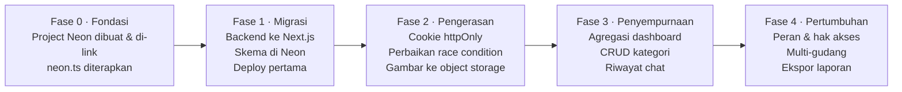

# Business Requirement Document (BRD)
## Smart Inventory System

| Field | Nilai |
|---|---|
| Versi dokumen | 1.0 |
| Tanggal | 3 Oktober 2026 |
| Status | Draft untuk review |
| Pemilik dokumen | reyfuu |
| Dokumen terkait | [PRD.md](PRD.md) · [FRD.md](FRD.md) · [TRD.md](TRD.md) |

---

## 1. Ringkasan Eksekutif

Smart Inventory System adalah aplikasi web manajemen persediaan barang untuk usaha kecil–menengah, dilengkapi asisten AI berbasis Google Gemini yang dapat menjawab pertanyaan tentang kondisi stok dalam bahasa alami.

Sistem ini **sudah ada dan berfungsi** sebagai aplikasi berbasis Docker Compose yang dijalankan di mesin lokal. Dokumen ini mendefinisikan kebutuhan bisnis untuk membawanya menjadi **aplikasi yang dapat diakses publik lewat internet dengan biaya operasional Rp 0**, memanfaatkan Vercel Hobby plan dan Neon Postgres free tier.

---

## 2. Latar Belakang & Problem Statement

### 2.1 Masalah bisnis yang mendasari

Pengelolaan persediaan pada usaha kecil umumnya masih bertumpu pada spreadsheet atau catatan manual. Konsekuensinya:

| Masalah | Dampak bisnis |
|---|---|
| Pencatatan stok manual | Data stok tidak real-time; keputusan pembelian berdasarkan angka yang sudah basi |
| Tidak ada audit trail | Selisih stok tidak bisa dilacak penyebabnya — tidak jelas kapan dan siapa yang mengubah |
| Kehabisan stok tidak terdeteksi | Kehilangan penjualan karena barang laris habis tanpa disadari |
| Input data memakan waktu | Mengetik deskripsi dan menentukan kategori tiap barang baru adalah pekerjaan berulang |
| Butuh keahlian teknis untuk analisis | Pertanyaan sederhana seperti "berapa nilai aset di kategori Elektronik" memerlukan rumus spreadsheet |

### 2.2 Masalah operasional sistem saat ini

Aplikasi sudah dibangun, tetapi **hanya bisa dijalankan di satu komputer**:

- Perlu Docker, Go, dan Node.js terpasang untuk menjalankannya.
- Tidak dapat diakses dari perangkat lain, dari luar kantor, maupun dari ponsel.
- Tidak ada cadangan data otomatis — data hilang jika volume Docker terhapus.
- Tidak ada lingkungan staging untuk menguji perubahan sebelum dipakai.

**Inti masalahnya:** nilai bisnis sistem ini tidak bisa direalisasikan selama ia hanya hidup di `localhost`.

---

## 3. Tujuan Bisnis & Metrik Keberhasilan

| # | Tujuan bisnis | Metrik keberhasilan | Target |
|---|---|---|---|
| BO-1 | Sistem dapat diakses dari mana saja | Aplikasi tersedia di URL publik dengan HTTPS | 100% uptime bulanan menurut Vercel |
| BO-2 | Biaya operasional nol | Total tagihan bulanan Vercel + Neon + Gemini | Rp 0 |
| BO-3 | Mempercepat input barang baru | Waktu input satu produk baru | < 60 detik, turun dari ±3 menit manual |
| BO-4 | Mencegah kehabisan stok | Produk di bawah ambang batas terdeteksi | Terlihat di dashboard pada kunjungan pertama, tanpa perlu dicari |
| BO-5 | Audit trail lengkap | Persentase perubahan stok yang tercatat | 100% — tidak ada mutasi stok tanpa jejak |
| BO-6 | Analisis tanpa keahlian teknis | Pertanyaan stok yang terjawab lewat chat AI | ≥ 80% pertanyaan umum terjawab tanpa buka menu lain |
| BO-7 | Data aman dari kehilangan | Mekanisme cadangan | Point-in-time restore aktif di Neon |

---

## 4. Stakeholder

| Peran | Siapa | Kepentingan | RACI |
|---|---|---|---|
| Product Owner | reyfuu | Menentukan prioritas fitur dan menerima hasil | **A** |
| Developer | reyfuu | Merancang, membangun, melakukan deployment | **R** |
| Admin Gudang | Pengguna harian | Input produk, mencatat stok masuk/keluar | **C** |
| Pemilik Usaha | Pengambil keputusan | Melihat nilai aset, alert stok, laporan | **C** |
| Penyedia platform | Vercel, Neon, Google | Menyediakan hosting, database, model AI | **I** |

---

## 5. Ruang Lingkup

### 5.1 Termasuk dalam lingkup

- Autentikasi pengguna berbasis email dan kata sandi.
- Manajemen kategori dan produk (buat, baca, ubah, hapus).
- Pencatatan transaksi stok masuk dan keluar beserta catatan.
- Dashboard dengan indikator kinerja dan peringatan stok rendah.
- Bantuan AI untuk mengisi deskripsi dan kategori produk secara otomatis.
- Asisten chat AI yang membaca data inventaris secara real-time.
- Unggah gambar produk.
- Deployment publik ke Vercel dengan database Neon.

### 5.2 Di luar lingkup (versi ini)

| Tidak termasuk | Alasan |
|---|---|
| Multi-tenant / multi-perusahaan | Sistem dirancang untuk satu organisasi |
| Peran dan hak akses berjenjang | Hanya ada satu tingkat pengguna: admin |
| Manajemen pemasok dan pesanan pembelian | Fokus pada persediaan, bukan rantai pasok |
| Titik penjualan (POS) dan pembayaran | Bukan sistem kasir |
| Barcode dan pemindaian | Membutuhkan perangkat keras tambahan |
| Multi-gudang / multi-lokasi | Model data saat ini mengasumsikan satu lokasi |
| Aplikasi mobile native | Antarmuka web sudah responsif |
| Ekspor akuntansi dan integrasi pajak | Di luar domain persediaan |
| Penggunaan komersial | Dilarang oleh ketentuan Vercel Hobby plan |

---

## 6. Model Biaya

### 6.1 Perbandingan biaya

| Komponen | Kondisi saat ini (VPS + Docker) | Target (Vercel Hobby + Neon) |
|---|---|---|
| Hosting aplikasi | VPS ±Rp 80.000–150.000/bulan | Rp 0 |
| Database | Di dalam VPS yang sama | Rp 0 (Neon free tier) |
| Penyimpanan gambar | Di dalam database | Rp 0 (object storage free tier) |
| Domain & TLS | Sertifikat manual / Let's Encrypt | Rp 0 (subdomain `.vercel.app` + TLS otomatis) |
| AI | Gemini free tier | Rp 0 (Gemini free tier) |
| Pemeliharaan server | Patching OS, monitoring, backup manual | Tidak ada — dikelola platform |
| **Total** | **±Rp 80.000–150.000/bulan + waktu** | **Rp 0** |

### 6.2 Kapan harus naik ke plan berbayar

Free tier bukan solusi selamanya. Pemicu untuk naik kelas:

| Pemicu | Konsekuensi | Langkah |
|---|---|---|
| Aplikasi dipakai untuk aktivitas komersial | Melanggar ketentuan Vercel Hobby | Naik ke Vercel Pro |
| Kuota penyimpanan Neon terlampaui | Operasi tulis ditolak | Naik ke Neon Launch plan |
| Bandwidth Vercel bulanan terlampaui | Deployment dibatasi hingga siklus berikutnya | Naik ke Vercel Pro |
| Butuh lebih dari satu pengguna dengan peran berbeda | Di luar lingkup versi ini | Masuk roadmap v2 |
| Kuota permintaan Gemini free tier habis | Fitur AI gagal | Aktifkan penagihan Google AI Studio |

> **Catatan verifikasi:** angka kuota spesifik (ukuran penyimpanan, bandwidth, batas permintaan) sengaja tidak dicantumkan di dokumen ini karena berubah sewaktu-waktu. Periksa dashboard Vercel, Neon, dan Google AI Studio sebelum perencanaan kapasitas.

---

## 7. Asumsi

| # | Asumsi | Dampak jika salah |
|---|---|---|
| A-1 | Penggunaan bersifat non-komersial | Harus pindah ke plan berbayar |
| A-2 | Satu organisasi, maksimal belasan pengguna | Model data perlu dirombak untuk multi-tenant |
| A-3 | Volume data tetap jauh di bawah kuota free tier | Perlu arsip data atau naik plan |
| A-4 | Google Gemini tetap menyediakan free tier | Fitur AI harus dinonaktifkan atau dibiayai |
| A-5 | Jeda dingin database (cold start) dapat diterima | Perlu plan yang tidak melakukan autosuspend |
| A-6 | Pengguna berbahasa Indonesia | Perlu internasionalisasi |

---

## 8. Kendala

| # | Kendala | Sumber |
|---|---|---|
| C-1 | Tidak boleh ada biaya berlangganan | Keputusan bisnis |
| C-2 | Vercel tidak dapat menjalankan server Go yang berjalan terus-menerus | Arsitektur platform |
| C-3 | Vercel Hobby melarang penggunaan komersial | Ketentuan layanan |
| C-4 | Database di-suspend otomatis saat idle | Perilaku Neon free tier |
| C-5 | Fungsi serverless punya batas durasi eksekusi | Batasan platform |
| C-6 | Region database adalah `aws-ap-southeast-1` (Singapura) | Project Neon yang sudah ada |

---

## 9. Risiko Bisnis

| # | Risiko | Kemungkinan | Dampak | Mitigasi |
|---|---|---|---|---|
| R-1 | Penyedia mengubah atau menghapus free tier | Sedang | Tinggi | Pakai Postgres standar tanpa fitur terkunci vendor; `pg_dump` tetap bisa memindahkan data |
| R-2 | Kehabisan kuota tanpa disadari → layanan berhenti | Sedang | Tinggi | Aktifkan notifikasi penggunaan di Vercel dan Neon |
| R-3 | Kredensial bocor karena salah konfigurasi | Rendah | Kritis | Semua rahasia lewat environment variable; `.env*` dan `.neon` masuk `.gitignore` |
| R-4 | Migrasi backend Go → TypeScript menimbulkan regresi | Tinggi | Sedang | Migrasi bertahap per modul dengan kriteria selesai yang jelas (lihat [TRD.md](TRD.md)) |
| R-5 | Kehilangan data saat migrasi dari Postgres lokal ke Neon | Rendah | Kritis | Ambil dump sebelum migrasi; verifikasi jumlah baris setelahnya |
| R-6 | Jawaban AI keliru dan dipakai mengambil keputusan | Sedang | Sedang | AI hanya membaca data, tidak pernah menulis; dashboard tetap jadi sumber kebenaran |
| R-7 | Jeda lintas region memperlambat aplikasi | Sedang | Sedang | Tempatkan fungsi Vercel di region yang sama dengan database (lihat [TRD.md](TRD.md)) |

---

## 10. Roadmap

| Fase | Fokus | Status |
|---|---|---|
| Fase 0 | Project Neon dibuat, di-link ke direktori kerja, kebijakan `neon.ts` diterapkan | **Selesai** |
| Fase 1 | Migrasi backend ke Next.js Route Handlers, skema di Neon, deployment pertama | Berikutnya |
| Fase 2 | Pengerasan keamanan dan perbaikan cacat yang teridentifikasi | Direncanakan |
| Fase 3 | Penyempurnaan fungsional | Direncanakan |
| Fase 4 | Pertumbuhan kapabilitas — butuh plan berbayar | Backlog |

---

## 11. Kriteria Penerimaan Tingkat Bisnis

Proyek dinyatakan berhasil apabila seluruh butir berikut terpenuhi:

- [ ] Aplikasi dapat diakses lewat URL publik dengan HTTPS dari perangkat mana pun.
- [ ] Tagihan bulanan dari seluruh penyedia adalah Rp 0.
- [ ] Seluruh fungsi yang ada di versi lokal tetap berjalan setelah migrasi — tidak ada fitur yang hilang.
- [ ] Data produk dan transaksi dari basis data lokal berhasil dipindahkan tanpa kehilangan baris.
- [ ] Peringatan stok rendah terlihat tanpa interaksi tambahan saat dashboard dibuka.
- [ ] Asisten AI menjawab pertanyaan menggunakan data produksi yang aktual.
- [ ] Tidak ada kredensial yang tersimpan di dalam repositori git.
- [ ] Temuan keamanan yang tercatat di [TRD.md](TRD.md) bagian pengerasan sudah ditutup.
