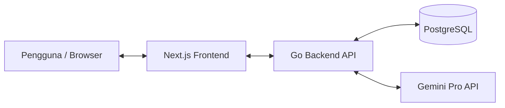

# System Design & Architecture - Smart Inventory System

Dokumen ini mendeskripsikan arsitektur sistem, skema database, dan mekanisme integrasi AI (Gemini Agent) untuk Smart Inventory System.

---

## 1. Arsitektur Sistem

Sistem ini dirancang menggunakan arsitektur 3-tier:
1. **Frontend (Next.js)**: Aplikasi web interaktif berbasis App Router. Berkomunikasi dengan backend via REST API dan WebSockets/HTTP Server-Sent Events (atau Polling teratur) untuk Chat Agent.
2. **Backend (Go/Fiber)**: API service yang menangani validasi, business logic, integrasi database, dan bertindak sebagai koordinator agen AI (Gemini SDK).
3. **Database (PostgreSQL)**: Penyimpanan relasional untuk entitas produk, kategori, dan transaksi stok.



---

## 2. Skema Database (PostgreSQL)

Berikut adalah relasi antar-tabel dalam database inventaris:

```mermaid
erDiagram
    CATEGORIES ||--o{ PRODUCTS : "memiliki"
    PRODUCTS ||--o{ STOCK_TRANSACTIONS : "mencatat"

    CATEGORIES {
        UUID id PK
        VARCHAR name
        TEXT description
        TIMESTAMP created_at
    }

    PRODUCTS {
        UUID id PK
        VARCHAR sku UNIQUE
        VARCHAR name
        TEXT description
        UUID category_id FK
        INT quantity
        DECIMAL price_buy
        DECIMAL price_sell
        INT low_stock_threshold
        TIMESTAMP created_at
        TIMESTAMP updated_at
    }

    STOCK_TRANSACTIONS {
        UUID id PK
        UUID product_id FK
        VARCHAR type "IN / OUT"
        INT quantity
        TEXT notes
        TIMESTAMP created_at
    }
```

### Script DDL (PostgreSQL)
Akan di-handle secara otomatis oleh ORM (GORM) di Go, atau migrasi SQL dasar:
* **Table `categories`**: Menyimpan kategori produk (elektronik, pakaian, dll).
* **Table `products`**: Data produk lengkap beserta kuantitas saat ini.
* **Table `stock_transactions`**: Riwayat keluar/masuk barang untuk audit trail dan pelacakan arus barang.

---

## 3. Desain Agen AI & Gemini Skills (Tools)

Untuk mengimplementasikan chat agen AI yang pintar, kita akan menggunakan fitur **Gemini Function Calling (Tool Calling)**. 

### Bagaimana Gemini Berinteraksi dengan Data Riil?
1. Pengguna mengirimkan pesan text ke backend Go (misalnya: *"Barang apa saja yang hampir habis?"*).
2. Backend Go meneruskan chat tersebut ke **Gemini model** dengan menyertakan definisi **Tools (Functions)** yang bisa dipanggil oleh Gemini.
3. Gemini menganalisis intent pengguna dan memutuskan untuk memanggil fungsi tertentu, misalnya `GetLowStockProducts()`.
4. Backend menangkap request pemanggilan fungsi tersebut, mengeksekusi query SQL ke PostgreSQL, dan mengembalikan hasilnya ke Gemini.
5. Gemini menyusun jawaban akhir dalam bahasa alami yang ramah berdasarkan data yang dikembalikan dan mengirimkannya kembali ke pengguna.

### Daftar Gemini Tools / Skills yang Disediakan:
* **`get_inventory_summary()`**: Mengembalikan ringkasan total item, total kategori, dan estimasi total nilai aset.
* **`get_low_stock_products()`**: Mengembalikan daftar produk yang kuantitasnya kurang dari atau sama dengan `low_stock_threshold`.
* **`search_products(query string)`**: Mencari barang berdasarkan nama atau deskripsi.
* **`get_stock_transactions(product_id string)`**: Mengambil riwayat transaksi stok masuk/keluar untuk produk tertentu.

---

## 4. Mekanisme Run & Develop (Lokal)

Untuk memudahkan pengembangan, sistem ini menyediakan:
* **Docker Compose**: Menjalankan PostgreSQL instance dengan konfigurasi port default `5432`.
* **Single Dev Script**: Script di root directory yang memungkinkan pengguna menjalankan backend dan frontend sekaligus hanya dengan satu perintah: `npm run dev` (menggunakan library `concurrently` di root).
