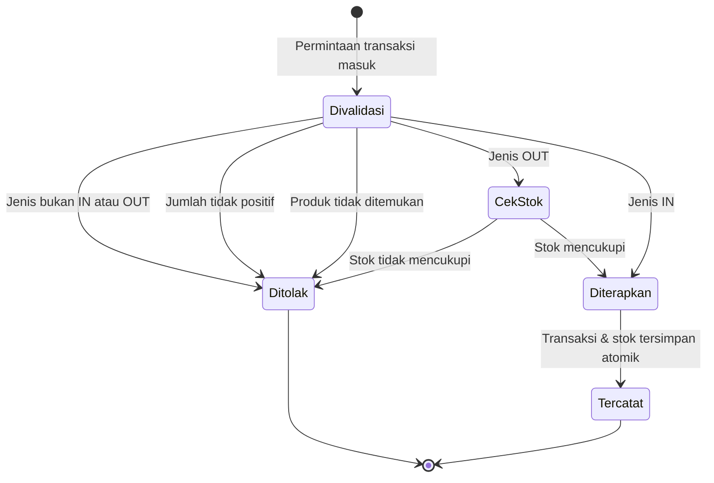

# Functional Requirement Document (FRD)
## Smart Inventory System

| Field | Nilai |
|---|---|
| Versi dokumen | 1.0 |
| Tanggal | 3 Oktober 2026 |
| Status | Draft untuk review |
| Dokumen terkait | [BRD.md](BRD.md) · [PRD.md](PRD.md) · [TRD.md](TRD.md) |

---

## 1. Tujuan Dokumen

Dokumen ini menjabarkan perilaku fungsional sistem secara rinci: apa yang terjadi pada setiap aksi pengguna, aturan validasi apa yang berlaku, dan respons apa yang dikembalikan sistem. Dokumen ini menjadi acuan bersama antara pengembangan dan pengujian.

**Konvensi status:**

| Penanda | Arti |
|---|---|
| ✅ Terimplementasi | Sudah ada dan berfungsi di kode saat ini |
| ⚠️ Terimplementasi sebagian | Ada, tetapi punya cacat yang tercatat |
| ❌ Belum ada | Requirement baru, belum ditulis kodenya |

---

## 2. Aktor dan Hak Akses

| Aktor | Deskripsi | Cara autentikasi |
|---|---|---|
| Tamu | Pengunjung yang belum masuk | — |
| Pengguna Terautentikasi | Pemegang sesi yang sah | Token JWT |
| Sistem | Proses latar seperti pembuatan SKU dan pencatatan stok awal | Internal |

### Matriks hak akses

| Kemampuan | Tamu | Pengguna Terautentikasi |
|---|---|---|
| Masuk ke sistem | ✓ | ✓ |
| Melihat identitas sendiri | — | ✓ |
| Melihat & membuat kategori | — | ✓ |
| Mengubah & menghapus kategori | — | ✓ *(belum ada)* |
| Operasi penuh pada produk | — | ✓ |
| Melihat & membuat transaksi stok | — | ✓ |
| Melihat ringkasan dashboard | — | ✓ |
| Memakai fitur AI | — | ✓ |

> Sistem saat ini hanya mengenal satu tingkat akses. Seluruh pengguna terautentikasi memiliki kewenangan yang sama. Pemisahan peran masuk roadmap v2.0.

---

## 3. Requirement Fungsional

### 3.1 Modul Autentikasi

| ID | Requirement | Prioritas | Status |
|---|---|---|---|
| FR-AUTH-01 | Sistem harus mengautentikasi pengguna berdasarkan email dan kata sandi | Wajib | ✅ |
| FR-AUTH-02 | Sistem harus menyimpan kata sandi dalam bentuk hash, tidak pernah sebagai teks biasa | Wajib | ✅ |
| FR-AUTH-03 | Sistem harus menerbitkan token sesi dengan masa berlaku 24 jam setelah autentikasi berhasil | Wajib | ✅ |
| FR-AUTH-04 | Sistem harus menolak akses ke seluruh endpoint inventaris tanpa token yang sah | Wajib | ✅ |
| FR-AUTH-05 | Sistem harus mengembalikan identitas pengguna dari sesi aktif | Wajib | ✅ |
| FR-AUTH-06 | Token sesi harus disimpan dengan cara yang tidak dapat dibaca oleh JavaScript di browser | Wajib | ❌ |
| FR-AUTH-07 | Rahasia penanda tangan token harus berasal dari environment variable, tanpa nilai cadangan di dalam kode | Wajib | ❌ |
| FR-AUTH-08 | Sistem harus mengakhiri sesi dan mengarahkan pengguna ke halaman masuk saat token tidak lagi sah | Wajib | ✅ |
| FR-AUTH-09 | Sistem harus menyediakan pembuatan akun pengguna baru | Sebaiknya | ❌ |

**FR-AUTH-01 — Rincian**

| Aspek | Keterangan |
|---|---|
| Aktor | Tamu |
| Pemicu | Pengguna mengirim formulir masuk |
| Prasyarat | Pengguna memiliki akun terdaftar |
| Kondisi akhir | Token sesi diterbitkan dan identitas pengguna dikembalikan |
| Validasi | Email wajib diisi dan berformat email; kata sandi wajib diisi |
| Aturan bisnis | Email yang tidak terdaftar dan kata sandi yang salah harus menghasilkan pesan kesalahan yang **identik**, agar penyerang tidak dapat memetakan email mana yang terdaftar |
| Penanganan kesalahan | Kolom kosong → 400; kredensial salah → 401; kegagalan penerbitan token → 500 |

**FR-AUTH-06 — Catatan cacat.** Token saat ini disimpan di `localStorage` ([frontend/src/lib/api.ts](../frontend/src/lib/api.ts)), sehingga dapat dibaca oleh skrip apa pun yang berhasil dieksekusi di halaman. Target: cookie dengan atribut `httpOnly`, `Secure`, dan `SameSite`.

**FR-AUTH-07 — Catatan cacat.** Fungsi `jwtSecret()` di [backend/internal/handler/auth.go:20](../backend/internal/handler/auth.go#L20) memakai nilai cadangan `"smartstock-super-secret-2026"` ketika environment variable tidak diset. Karena nilai ini ada di repositori, siapa pun yang membacanya dapat menerbitkan token yang dianggap sah. Target: gagal saat startup bila rahasia tidak tersedia.

---

### 3.2 Modul Kategori

| ID | Requirement | Prioritas | Status |
|---|---|---|---|
| FR-CAT-01 | Sistem harus menampilkan seluruh kategori | Wajib | ✅ |
| FR-CAT-02 | Sistem harus dapat membuat kategori baru | Wajib | ✅ |
| FR-CAT-03 | Sistem harus dapat mengubah nama dan deskripsi kategori | Sebaiknya | ❌ |
| FR-CAT-04 | Sistem harus dapat menghapus kategori yang tidak dipakai produk mana pun | Sebaiknya | ❌ |
| FR-CAT-05 | Sistem harus menolak penghapusan kategori yang masih dipakai, disertai jumlah produk terkait | Sebaiknya | ❌ |
| FR-CAT-06 | Nama kategori harus unik | Sebaiknya | ❌ |

**Aturan bisnis**
- Nama kategori wajib diisi; deskripsi opsional.
- Setiap produk harus memiliki tepat satu kategori.
- Sistem menyediakan empat kategori awal saat basis data pertama kali diisi: Elektronik, Pakaian, Makanan & Minuman, Peralatan Rumah Tangga.

---

### 3.3 Modul Produk

| ID | Requirement | Prioritas | Status |
|---|---|---|---|
| FR-PROD-01 | Sistem harus menampilkan seluruh produk beserta data kategorinya | Wajib | ✅ |
| FR-PROD-02 | Sistem harus menampilkan satu produk berdasarkan pengenalnya | Wajib | ✅ |
| FR-PROD-03 | Sistem harus dapat membuat produk baru | Wajib | ✅ |
| FR-PROD-04 | Sistem harus membuat SKU secara otomatis bila tidak diisi pengguna | Wajib | ✅ |
| FR-PROD-05 | Pembaruan produk harus bersifat parsial — kolom yang tidak dikirim tidak boleh berubah | Wajib | ⚠️ |
| FR-PROD-06 | Sistem harus dapat menghapus produk beserta seluruh riwayat transaksinya | Wajib | ✅ |
| FR-PROD-07 | Sistem harus mencatat satu transaksi stok masuk saat produk dibuat dengan jumlah lebih dari nol | Wajib | ✅ |
| FR-PROD-08 | Jumlah stok tidak boleh diubah lewat pembaruan produk, melainkan hanya lewat transaksi | Wajib | ✅ |
| FR-PROD-09 | Gambar produk harus disimpan di penyimpanan objek, dan basis data hanya menyimpan tautannya | Wajib | ❌ |
| FR-PROD-10 | Sistem harus mendukung paginasi, pencarian, dan penyaringan di sisi server | Sebaiknya | ❌ |
| FR-PROD-11 | SKU harus unik di seluruh produk | Wajib | ✅ |

**FR-PROD-04 — Aturan pembuatan SKU**

Format: `<tiga huruf pertama nama kategori dalam huruf kapital>-<enam karakter pertama UUID acak>`, contoh `ELE-a3f9c2`. Bila nama kategori kurang dari tiga huruf, awalan yang dipakai adalah `GEN`. Implementasi ada pada `GenerateSKU` di [backend/internal/service/gemini.go](../backend/internal/service/gemini.go).

**FR-PROD-05 — Catatan cacat.** Pada `UpdateProduct` ([backend/internal/handler/handler.go:126](../backend/internal/handler/handler.go#L126)), kolom `description` dan `image_url` di-assign tanpa pemeriksaan apa pun dari isi permintaan. Akibatnya, permintaan pembaruan yang hanya ingin mengubah harga akan **mengosongkan deskripsi dan gambar** produk tersebut. Kolom lain (`name`, `category_id`, `price_buy`, `price_sell`) sudah dijaga, meski penjagaannya memakai "nilai bukan nol" sehingga harga tidak dapat diubah menjadi 0.

**FR-PROD-09 — Catatan cacat.** Formulir produk membaca berkas gambar dengan `FileReader` dan menuliskan hasilnya sebagai data URL berbasis base64 langsung ke kolom `image_url` ([frontend/src/app/products/page.tsx:145-149](../frontend/src/app/products/page.tsx#L145-L149)). Satu foto berukuran 200 KB menjadi sekitar 270 KB teks di dalam satu baris basis data. Dampaknya: kuota penyimpanan cepat habis, setiap pengambilan daftar produk mengirim seluruh gambar, dan gambar tidak dapat di-cache oleh browser secara terpisah.

**Aturan validasi produk**

| Kolom | Wajib | Aturan |
|---|---|---|
| `name` | Ya | Tidak boleh kosong |
| `category_id` | Ya | Harus UUID yang sah dan merujuk kategori yang ada |
| `sku` | Tidak | Bila kosong akan dibuat otomatis; harus unik |
| `description` | Tidak | Teks bebas |
| `quantity` | Tidak | Bilangan bulat, minimal 0, baku 0 |
| `price_buy` | Tidak | Minimal 0 |
| `price_sell` | Tidak | Minimal 0 |
| `low_stock_threshold` | Tidak | Bilangan bulat, minimal 0, baku 5 |
| `image_url` | Tidak | Harus berupa tautan — bukan data URL *(target)* |

---

### 3.4 Modul Transaksi Stok

| ID | Requirement | Prioritas | Status |
|---|---|---|---|
| FR-TRX-01 | Sistem harus menampilkan seluruh transaksi, diurutkan dari yang terbaru | Wajib | ✅ |
| FR-TRX-02 | Sistem harus dapat mencatat transaksi stok masuk dan menambah jumlah stok produk | Wajib | ✅ |
| FR-TRX-03 | Sistem harus dapat mencatat transaksi stok keluar dan mengurangi jumlah stok produk | Wajib | ✅ |
| FR-TRX-04 | Sistem harus menolak transaksi keluar yang melebihi jumlah stok tersedia | Wajib | ✅ |
| FR-TRX-05 | Pemeriksaan kecukupan stok dan pengurangan stok harus berlangsung secara atomik | Wajib | ⚠️ |
| FR-TRX-06 | Sistem harus menolak jenis transaksi selain `IN` dan `OUT` | Wajib | ✅ |
| FR-TRX-07 | Setiap transaksi harus dapat menyertakan catatan bebas | Wajib | ✅ |
| FR-TRX-08 | Pencatatan transaksi dan pembaruan stok harus berada dalam satu transaksi basis data | Wajib | ✅ |
| FR-TRX-09 | Transaksi bersifat hanya-tambah — tidak dapat diubah maupun dihapus | Wajib | ✅ |
| FR-TRX-10 | Sistem harus mendukung penyaringan riwayat berdasarkan produk dan rentang tanggal | Sebaiknya | ❌ |
| FR-TRX-11 | Jumlah stok produk tidak boleh menjadi negatif dalam kondisi apa pun | Wajib | ❌ |

**FR-TRX-05 — Catatan cacat.** Urutan operasi pada `CreateTransaction` ([backend/internal/handler/handler.go:213](../backend/internal/handler/handler.go#L213)) adalah sebagai berikut: produk dibaca dari basis data, lalu nilai `product.Quantity` dihitung di memori pada baris [240](../backend/internal/handler/handler.go#L240) dan [246](../backend/internal/handler/handler.go#L246), **baru kemudian** transaksi basis data dibuka pada baris [259](../backend/internal/handler/handler.go#L259).

Artinya pemeriksaan "stok mencukupi" terjadi di luar transaksi. Dua permintaan `OUT` yang tiba bersamaan untuk produk yang sama dapat sama-sama membaca stok 10, sama-sama lolos pemeriksaan untuk pengeluaran 8, lalu keduanya menuliskan hasil — menyisakan stok 2 padahal 16 unit telah dikeluarkan. Perbaikan yang disarankan ada di [TRD.md](TRD.md).

**State machine transaksi**



**Aturan bisnis**
- Transaksi `IN` menambah stok; transaksi `OUT` mengurangi stok.
- Produk yang dibuat dengan jumlah awal lebih dari nol menghasilkan transaksi `IN` dengan catatan `"Stok awal produk baru"`.
- Menghapus produk juga menghapus seluruh transaksinya — jejak audit produk tersebut ikut hilang. Keputusan ini disengaja agar tidak ada transaksi yatim.

---

### 3.5 Modul Dashboard

| ID | Requirement | Prioritas | Status |
|---|---|---|---|
| FR-DASH-01 | Sistem harus menampilkan jumlah produk, jumlah kategori, dan total nilai aset | Wajib | ✅ |
| FR-DASH-02 | Sistem harus menampilkan daftar produk yang berada pada atau di bawah ambang batas stoknya | Wajib | ✅ |
| FR-DASH-03 | Angka ringkasan harus dihitung di basis data, bukan di browser | Wajib | ❌ |
| FR-DASH-04 | Sistem harus menampilkan tren stok masuk dan keluar dalam bentuk grafik | Boleh | ❌ |

**Rumus perhitungan**

| Indikator | Rumus |
|---|---|
| Total produk | Jumlah baris pada tabel produk |
| Total kategori | Jumlah baris pada tabel kategori |
| Total nilai aset | Jumlah dari (jumlah stok × harga beli) seluruh produk |
| Produk stok rendah | Produk yang jumlah stoknya kurang dari atau sama dengan ambang batasnya |

**FR-DASH-03 — Catatan cacat.** Dashboard saat ini mengunduh **seluruh** tabel produk dan kategori, lalu menghitung keempat indikator di browser ([frontend/src/app/page.tsx:42-45](../frontend/src/app/page.tsx#L42-L45)). Pada 50 produk hal ini tidak terasa; pada 5.000 produk — terlebih bila gambar masih tersimpan sebagai base64 di dalam baris — halaman akan sangat lambat. Target: satu endpoint ringkasan yang mengembalikan angka jadi.

---

### 3.6 Modul Asisten AI

| ID | Requirement | Prioritas | Status |
|---|---|---|---|
| FR-AI-01 | Sistem harus menyarankan deskripsi dan kategori produk berdasarkan nama produk | Wajib | ✅ |
| FR-AI-02 | Saran kategori harus dicocokkan dengan kategori yang benar-benar ada di basis data | Wajib | ✅ |
| FR-AI-03 | Sistem harus menyediakan antarmuka percakapan untuk bertanya tentang inventaris | Wajib | ✅ |
| FR-AI-04 | Asisten harus mengambil data nyata dari basis data lewat pemanggilan fungsi | Wajib | ✅ |
| FR-AI-05 | Asisten harus menjawab dalam Bahasa Indonesia | Wajib | ✅ |
| FR-AI-06 | Sistem harus tetap berjalan normal tanpa kunci API AI | Wajib | ✅ |
| FR-AI-07 | Asisten tidak boleh memiliki kemampuan mengubah data | Wajib | ✅ |
| FR-AI-08 | Riwayat percakapan harus bertahan antar sesi | Boleh | ❌ |
| FR-AI-09 | Jawaban harus ditampilkan secara bertahap saat dihasilkan | Sebaiknya | ❌ |

**Daftar tool yang tersedia bagi asisten**

| Tool | Parameter | Dikembalikan | Operasi basis data |
|---|---|---|---|
| `get_inventory_summary` | — | Total produk, total kategori, total nilai aset | Hanya baca |
| `get_low_stock_products` | — | Daftar produk di bawah ambang batas beserta jumlahnya | Hanya baca |
| `search_products` | `query` (teks) | Produk yang namanya atau deskripsinya mengandung kata kunci | Hanya baca |

> Ketiga tool bersifat hanya-baca. Tidak ada tool yang dapat menulis, sehingga asisten secara struktural tidak mampu mengubah data inventaris — ini memenuhi FR-AI-07 bukan lewat kebijakan, melainkan lewat desain.

**Perilaku saat kunci API tidak tersedia**

| Fitur | Perilaku cadangan |
|---|---|
| Saran produk | Mengembalikan deskripsi umum dan kategori baku "Elektronik" |
| Chat | Mengembalikan pesan yang menjelaskan bahwa kunci API perlu dikonfigurasi |

---

## 4. Kontrak API

Seluruh endpoint berada di bawah awalan `/api`. Kecuali disebutkan lain, endpoint memerlukan autentikasi.

### 4.1 Endpoint yang sudah ada (13 endpoint)

Daftar ini dicocokkan baris per baris dengan pendaftaran rute pada [backend/cmd/api/main.go:41-69](../backend/cmd/api/main.go#L41-L69).

| # | Metode | Path | Auth | Requirement |
|---|---|---|---|---|
| 1 | POST | `/api/auth/login` | Tidak | FR-AUTH-01 |
| 2 | GET | `/api/auth/me` | Ya | FR-AUTH-05 |
| 3 | GET | `/api/categories` | Ya | FR-CAT-01 |
| 4 | POST | `/api/categories` | Ya | FR-CAT-02 |
| 5 | GET | `/api/products` | Ya | FR-PROD-01 |
| 6 | GET | `/api/products/:id` | Ya | FR-PROD-02 |
| 7 | POST | `/api/products` | Ya | FR-PROD-03 |
| 8 | PUT | `/api/products/:id` | Ya | FR-PROD-05 |
| 9 | DELETE | `/api/products/:id` | Ya | FR-PROD-06 |
| 10 | GET | `/api/transactions` | Ya | FR-TRX-01 |
| 11 | POST | `/api/transactions` | Ya | FR-TRX-02, FR-TRX-03 |
| 12 | POST | `/api/products/ai-suggest` | Ya | FR-AI-01 |
| 13 | POST | `/api/ai/chat` | Ya | FR-AI-03 |

### 4.2 Rincian kontrak

#### POST `/api/auth/login`

Permintaan:
```json
{ "email": "admin@example.com", "password": "rahasia" }
```

Respons `200`:
```json
{
  "token": "eyJhbGciOiJIUzI1NiIs...",
  "user": { "id": "uuid", "email": "admin@example.com", "name": "Admin" }
}
```

| Kode | Kondisi | Isi pesan |
|---|---|---|
| 400 | Kolom kosong atau format email salah | `Email dan password wajib diisi.` |
| 401 | Email tidak terdaftar atau kata sandi salah | `Email atau password salah.` |
| 500 | Gagal menerbitkan token | `Gagal membuat token.` |

#### GET `/api/auth/me`

Respons `200`:
```json
{ "id": "uuid", "email": "admin@example.com", "name": "Admin" }
```

#### GET `/api/categories`

Respons `200` berupa larik kategori:
```json
[{ "id": "uuid", "name": "Elektronik", "description": "...", "created_at": "2026-10-03T00:00:00Z" }]
```

#### POST `/api/categories`

Permintaan:
```json
{ "name": "Alat Tulis", "description": "Perlengkapan kantor dan sekolah" }
```
Respons `201` berisi objek kategori yang terbentuk.

#### GET `/api/products`

Respons `200` berupa larik produk, masing-masing menyertakan objek kategori lengkap:
```json
[{
  "id": "uuid",
  "sku": "ELE-a3f9c2",
  "name": "Keyboard Mekanik",
  "description": "...",
  "category_id": "uuid",
  "category": { "id": "uuid", "name": "Elektronik", "description": "...", "created_at": "..." },
  "quantity": 12,
  "price_buy": 350000,
  "price_sell": 499000,
  "low_stock_threshold": 5,
  "image_url": "https://...",
  "created_at": "...",
  "updated_at": "..."
}]
```

#### POST `/api/products`

Permintaan — hanya `name` dan `category_id` yang wajib:
```json
{
  "name": "Keyboard Mekanik",
  "sku": "",
  "description": "Keyboard dengan sakelar biru",
  "category_id": "uuid",
  "quantity": 12,
  "price_buy": 350000,
  "price_sell": 499000,
  "low_stock_threshold": 5,
  "image_url": "https://..."
}
```

| Kode | Kondisi | Isi pesan |
|---|---|---|
| 201 | Berhasil | Objek produk |
| 400 | Kolom wajib kosong | Pesan validasi |
| 400 | `category_id` bukan UUID sah | `Invalid Category ID` |
| 500 | Kegagalan basis data, termasuk SKU duplikat | Pesan basis data |

#### PUT `/api/products/:id`

Permintaan — jumlah stok **tidak** dapat diubah di sini:
```json
{
  "name": "Keyboard Mekanik v2",
  "description": "...",
  "category_id": "uuid",
  "price_buy": 360000,
  "price_sell": 520000,
  "low_stock_threshold": 3,
  "image_url": "https://..."
}
```

> **Peringatan perilaku saat ini (FR-PROD-05):** mengirim permintaan tanpa menyertakan `description` dan `image_url` akan **mengosongkan** kedua kolom tersebut. Sampai cacat ini diperbaiki, klien wajib mengirim objek produk secara utuh.

#### DELETE `/api/products/:id`

Respons `200`:
```json
{ "message": "Product and related history deleted successfully" }
```
Seluruh transaksi milik produk tersebut ikut terhapus.

#### GET `/api/transactions`

Respons `200` berupa larik transaksi terurut dari yang terbaru, menyertakan produk dan kategorinya:
```json
[{
  "id": "uuid",
  "product_id": "uuid",
  "product": { "...": "objek produk lengkap" },
  "type": "IN",
  "quantity": 10,
  "notes": "Pembelian dari Supplier A",
  "created_at": "..."
}]
```

#### POST `/api/transactions`

Permintaan:
```json
{ "product_id": "uuid", "type": "OUT", "quantity": 3, "notes": "Penjualan ke Pelanggan B" }
```

| Kode | Kondisi | Isi pesan |
|---|---|---|
| 201 | Berhasil | Objek transaksi |
| 400 | Kolom wajib kosong | Pesan validasi |
| 400 | `product_id` bukan UUID sah | `Invalid Product ID` |
| 400 | Jenis selain IN/OUT | `Invalid transaction type (IN or OUT)` |
| 400 | Stok tidak mencukupi | `Insufficient stock` |
| 404 | Produk tidak ditemukan | `Product not found` |

#### POST `/api/products/ai-suggest`

Permintaan:
```json
{ "name": "Keyboard Mekanik" }
```
Respons `200`:
```json
{
  "description": "Keyboard dengan sakelar mekanik untuk mengetik dan bermain gim.",
  "suggested_category": "Elektronik",
  "category_id": "uuid"
}
```
Bila nama kategori hasil saran tidak cocok dengan kategori mana pun, sistem mengembalikan kategori pertama yang ada sebagai cadangan.

#### POST `/api/ai/chat`

Permintaan:
```json
{
  "history": [
    { "role": "user", "content": "Halo" },
    { "role": "model", "content": "Halo, ada yang bisa saya bantu?" }
  ],
  "message": "Barang apa saja yang hampir habis?"
}
```
Respons `200`:
```json
{ "reply": "Saat ini ada 3 produk yang stoknya menipis: ..." }
```

### 4.3 Endpoint baru yang diperlukan

| Metode | Path | Requirement | Tujuan |
|---|---|---|---|
| GET | `/api/dashboard/summary` | FR-DASH-03 | Mengembalikan indikator yang sudah dihitung di basis data |
| PUT | `/api/categories/:id` | FR-CAT-03 | Mengubah kategori |
| DELETE | `/api/categories/:id` | FR-CAT-04, FR-CAT-05 | Menghapus kategori yang tidak terpakai |
| POST | `/api/uploads/image` | FR-PROD-09 | Mengunggah gambar ke penyimpanan objek, mengembalikan tautannya |
| POST | `/api/auth/logout` | FR-AUTH-06 | Menghapus cookie sesi di sisi server |
| POST | `/api/users` | FR-AUTH-09 | Membuat akun pengguna baru |

**Rancangan respons GET `/api/dashboard/summary`:**
```json
{
  "total_products": 128,
  "total_categories": 6,
  "total_asset_value": 45780000,
  "low_stock_count": 4,
  "low_stock_products": [
    { "id": "uuid", "name": "Keyboard Mekanik", "sku": "ELE-a3f9c2", "quantity": 2, "low_stock_threshold": 5 }
  ]
}
```

**Rancangan parameter kueri GET `/api/products`** (FR-PROD-10):

| Parameter | Tipe | Baku | Keterangan |
|---|---|---|---|
| `page` | bilangan | 1 | Nomor halaman |
| `limit` | bilangan | 20 | Jumlah baris per halaman, maksimal 100 |
| `search` | teks | — | Dicocokkan dengan nama dan SKU |
| `category_id` | UUID | — | Menyaring berdasarkan kategori |
| `low_stock` | boolean | false | Hanya menampilkan produk di bawah ambang batas |

---

## 5. Daftar Pesan Kesalahan

| Kode | Pesan | Kapan muncul |
|---|---|---|
| 400 | `Email dan password wajib diisi.` | Formulir masuk tidak lengkap |
| 401 | `Email atau password salah.` | Kredensial tidak cocok |
| 401 | `Token tidak ditemukan. Silakan login terlebih dahulu.` | Header otorisasi tidak ada |
| 401 | `Token tidak valid atau sudah kadaluwarsa. Silakan login ulang.` | Token rusak atau lewat masa berlaku |
| 400 | `Invalid UUID format` | Pengenal pada path bukan UUID |
| 400 | `Invalid Category ID` | `category_id` bukan UUID sah |
| 400 | `Invalid Product ID` | `product_id` bukan UUID sah |
| 400 | `Invalid transaction type (IN or OUT)` | Jenis transaksi tidak dikenal |
| 400 | `Insufficient stock` | Stok keluar melebihi stok tersedia |
| 404 | `Product not found` | Produk tidak ada |
| 500 | `Gagal membuat token.` | Kegagalan penandatanganan token |

> **Catatan konsistensi.** Pesan kesalahan saat ini bercampur antara Bahasa Indonesia dan Bahasa Inggris. Modul autentikasi memakai Bahasa Indonesia, sedangkan modul inventaris memakai Bahasa Inggris. Pada versi target, seluruh pesan yang ditampilkan kepada pengguna diseragamkan ke Bahasa Indonesia.

---

## 6. Aturan Validasi Antarmuka

| Area | Aturan |
|---|---|
| Formulir masuk | Email dan kata sandi wajib; tombol dinonaktifkan selama permintaan berjalan |
| Formulir produk | Nama dan kategori wajib; harga tidak menerima nilai negatif |
| Formulir transaksi | Produk, jenis, dan jumlah wajib; jumlah minimal 1 |
| Unggah gambar | Hanya berkas bertipe gambar; batas ukuran perlu ditetapkan *(target)* |
| Seluruh formulir | Menampilkan indikator proses selama permintaan berlangsung |
| Seluruh daftar | Menampilkan keadaan kosong yang informatif, bukan tabel kosong tanpa penjelasan |

---

## 7. Matriks Ketertelusuran

| Requirement | User story | Berkas sumber saat ini |
|---|---|---|
| FR-AUTH-01 … 03 | US-1.1 | [auth.go:89](../backend/internal/handler/auth.go#L89) |
| FR-AUTH-04 | US-1.1 | [auth.go:53](../backend/internal/handler/auth.go#L53) |
| FR-AUTH-05 | US-1.2 | [auth.go:130](../backend/internal/handler/auth.go#L130) |
| FR-AUTH-06 | US-1.5 | [api.ts](../frontend/src/lib/api.ts) — perlu diubah |
| FR-AUTH-07 | US-1.5 | [auth.go:20](../backend/internal/handler/auth.go#L20) — perlu diubah |
| FR-AUTH-08 | US-1.4 | [api.ts](../frontend/src/lib/api.ts), [ClientLayout.tsx](../frontend/src/app/ClientLayout.tsx) |
| FR-CAT-01, 02 | US-2.1, US-2.2 | [handler.go:15](../backend/internal/handler/handler.go#L15), [handler.go:24](../backend/internal/handler/handler.go#L24) |
| FR-CAT-03 … 06 | US-2.3, US-2.4 | Belum ada |
| FR-PROD-01, 02 | US-3.1 | [handler.go:39](../backend/internal/handler/handler.go#L39), [handler.go:48](../backend/internal/handler/handler.go#L48) |
| FR-PROD-03, 04, 07 | US-3.2, US-3.3 | [handler.go:64](../backend/internal/handler/handler.go#L64) |
| FR-PROD-05 | US-3.4, US-3.8 | [handler.go:126](../backend/internal/handler/handler.go#L126) — perlu diperbaiki |
| FR-PROD-06 | US-3.5 | [handler.go:184](../backend/internal/handler/handler.go#L184) |
| FR-PROD-09 | US-3.6 | [products/page.tsx:145](../frontend/src/app/products/page.tsx#L145) — perlu diubah |
| FR-PROD-10 | US-3.7 | Belum ada |
| FR-TRX-01 | US-4.5 | [handler.go:204](../backend/internal/handler/handler.go#L204) |
| FR-TRX-02 … 04, 06 … 09 | US-4.1, US-4.2, US-4.4 | [handler.go:213](../backend/internal/handler/handler.go#L213) |
| FR-TRX-05, FR-TRX-11 | US-4.3 | [handler.go:240-259](../backend/internal/handler/handler.go#L240-L259) — perlu diperbaiki |
| FR-TRX-10 | US-4.6 | Belum ada |
| FR-DASH-01, 02 | US-5.1, US-5.2 | [page.tsx:42](../frontend/src/app/page.tsx#L42) |
| FR-DASH-03 | US-5.3 | Belum ada |
| FR-AI-01, 02 | US-6.1 | [handler.go:278](../backend/internal/handler/handler.go#L278), [gemini.go](../backend/internal/service/gemini.go) |
| FR-AI-03 … 07 | US-6.2 … US-6.5 | [handler.go:318](../backend/internal/handler/handler.go#L318), [gemini.go](../backend/internal/service/gemini.go), [AIChatWidget.tsx](../frontend/src/components/AIChatWidget.tsx) |
| FR-AI-08, 09 | US-6.6, US-6.7 | Belum ada |

Seluruh requirement pada dokumen ini terhubung ke setidaknya satu user story di [PRD.md](PRD.md), dan setiap user story berprioritas wajib memiliki setidaknya satu requirement yang mendukungnya.
