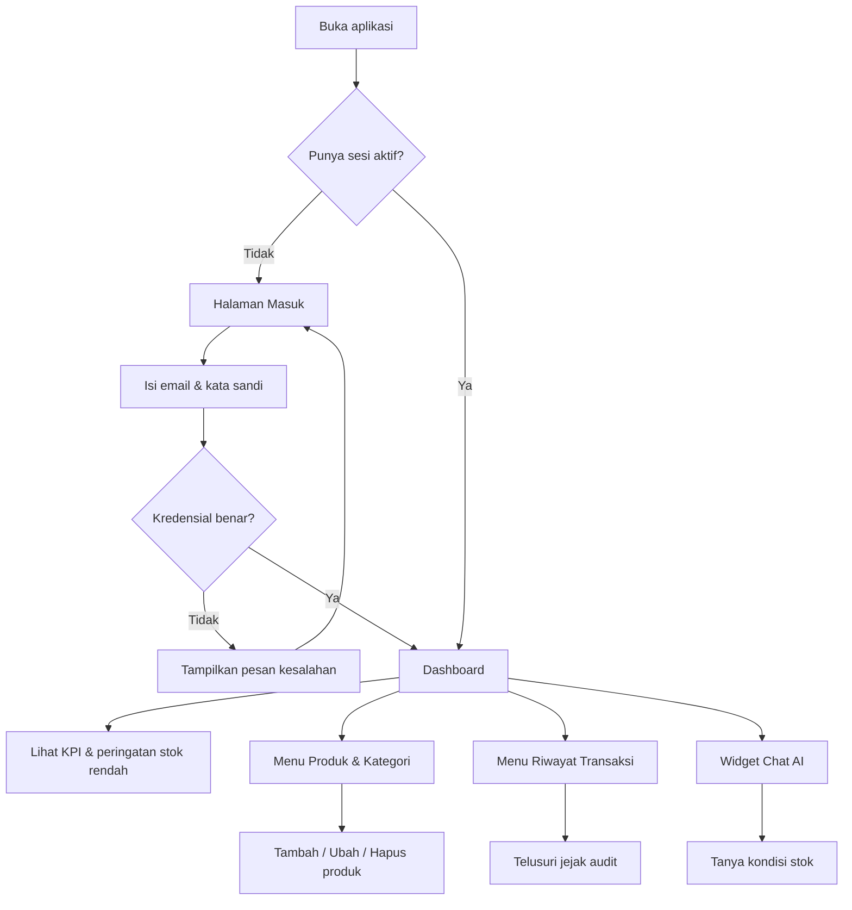
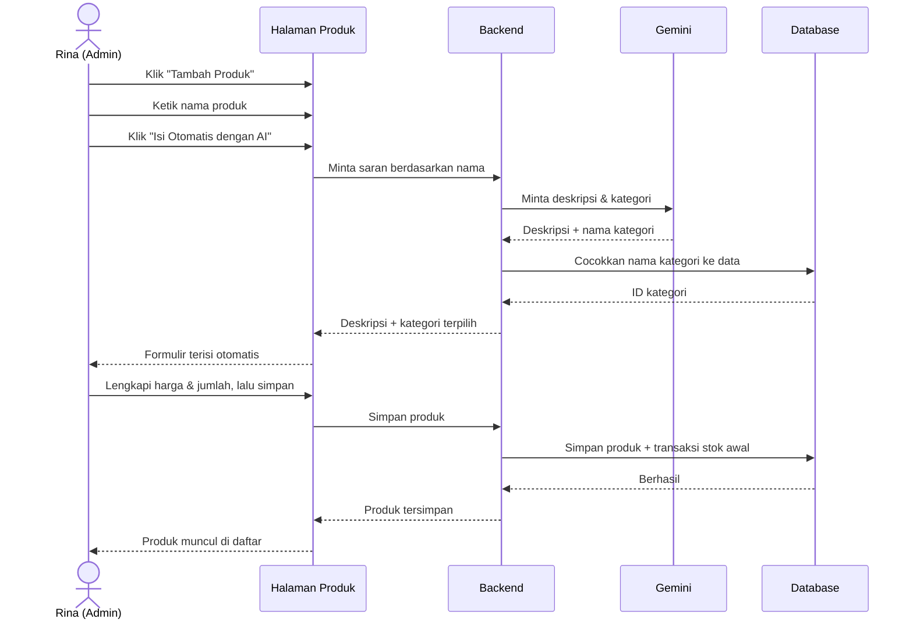
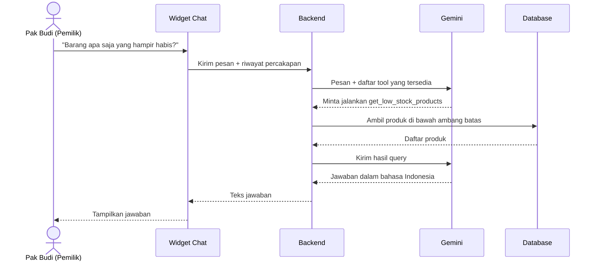

# Product Requirement Document (PRD)
## Smart Inventory System

| Field | Nilai |
|---|---|
| Versi dokumen | 2.0 (menggantikan v1.0 yang ringkas) |
| Tanggal | 3 Oktober 2026 |
| Status | Draft untuk review |
| Dokumen terkait | [BRD.md](BRD.md) · [FRD.md](FRD.md) · [TRD.md](TRD.md) |

---

## 1. Visi Produk

> Memberi pemilik usaha kecil kejelasan penuh atas persediaan mereka — tanpa spreadsheet, tanpa server, dan tanpa biaya — dengan asisten AI yang bisa diajak bicara seperti berbicara kepada staf gudang yang hafal seluruh isi gudang.

---

## 2. Persona Pengguna

### Persona 1 — Rina, Admin Gudang

| Aspek | Keterangan |
|---|---|
| Usia & peran | 27 tahun, staf administrasi gudang |
| Kemampuan teknis | Terbiasa Excel dan WhatsApp; tidak paham istilah teknis |
| Tugas harian | Mencatat barang datang, mencatat barang keluar, menambah produk baru |
| Frustrasi | Mengetik ulang deskripsi barang yang mirip; lupa barang mana yang mau habis |
| Perangkat | Laptop di gudang, kadang ponsel |
| Yang dibutuhkan | Input cepat, tidak banyak kolom wajib, konfirmasi jelas saat tersimpan |

### Persona 2 — Pak Budi, Pemilik Usaha

| Aspek | Keterangan |
|---|---|
| Usia & peran | 45 tahun, pemilik toko |
| Kemampuan teknis | Pengguna ponsel; jarang membuka aplikasi desktop |
| Tugas | Memantau nilai aset, memutuskan pembelian ulang |
| Frustrasi | Harus bertanya ke staf untuk tahu kondisi stok; laporan datang terlambat |
| Perangkat | Ponsel, sesekali laptop |
| Yang dibutuhkan | Angka ringkas di satu layar; bisa bertanya dengan bahasa sehari-hari |

---

## 3. Sasaran Produk

### 3.1 Sasaran

| # | Sasaran | Cara mengukur |
|---|---|---|
| PG-1 | Input produk baru terasa cepat | Rata-rata waktu dari klik "Tambah" hingga tersimpan < 60 detik |
| PG-2 | Kondisi stok terbaca sekali lihat | Seluruh indikator utama muat di satu layar tanpa menggulir |
| PG-3 | Tidak ada perubahan stok tanpa jejak | Setiap mutasi menghasilkan satu baris transaksi |
| PG-4 | Pertanyaan terjawab tanpa berpindah menu | Chat AI dapat diakses dari halaman mana pun |
| PG-5 | Berfungsi baik di ponsel | Semua alur utama dapat diselesaikan pada lebar layar 360 px |

### 3.2 Bukan sasaran

- Bukan sistem kasir — produk ini mencatat stok, bukan memproses penjualan.
- Bukan sistem akuntansi — tidak menghasilkan jurnal atau laporan pajak.
- Bukan platform multi-perusahaan — satu instalasi melayani satu organisasi.
- Chat AI bukan antarmuka untuk mengubah data — AI hanya membaca.

---

## 4. Epik dan User Story

Prioritas memakai **MoSCoW**: **M** = wajib (Must), **S** = sebaiknya (Should), **C** = boleh (Could), **W** = belum sekarang (Won't).

### Epik 1 — Autentikasi

| ID | User story | Prioritas | Status |
|---|---|---|---|
| US-1.1 | Sebagai pengguna, saya ingin masuk dengan email dan kata sandi agar data inventaris tidak bisa dilihat orang lain | **M** | Sudah ada |
| US-1.2 | Sebagai pengguna, saya ingin sesi saya bertahan setelah menyegarkan halaman agar tidak perlu masuk berulang kali | **M** | Sudah ada |
| US-1.3 | Sebagai pengguna, saya ingin keluar dari sistem agar akun aman di perangkat bersama | **M** | Sudah ada |
| US-1.4 | Sebagai pengguna, saya ingin diarahkan kembali ke halaman masuk ketika sesi berakhir agar tidak melihat halaman kosong yang membingungkan | **M** | Sudah ada |
| US-1.5 | Sebagai pengguna, saya ingin sesi saya tidak bisa dicuri lewat skrip berbahaya di browser | **M** | **Belum — lihat FR-AUTH-06** |
| US-1.6 | Sebagai pemilik, saya ingin menambah akun pengguna baru agar staf lain bisa memakai sistem | **S** | Belum |
| US-1.7 | Sebagai pengguna, saya ingin mengatur ulang kata sandi yang terlupa | **C** | Belum |

### Epik 2 — Manajemen Kategori

| ID | User story | Prioritas | Status |
|---|---|---|---|
| US-2.1 | Sebagai admin, saya ingin melihat daftar kategori agar bisa mengelompokkan produk | **M** | Sudah ada |
| US-2.2 | Sebagai admin, saya ingin menambah kategori baru agar produk baru punya tempat yang tepat | **M** | Sudah ada |
| US-2.3 | Sebagai admin, saya ingin mengubah nama dan deskripsi kategori ketika terjadi salah ketik | **S** | **Belum — tidak ada endpoint** |
| US-2.4 | Sebagai admin, saya ingin menghapus kategori yang tidak terpakai agar daftar tetap rapi | **S** | **Belum — tidak ada endpoint** |

### Epik 3 — Manajemen Produk

| ID | User story | Prioritas | Status |
|---|---|---|---|
| US-3.1 | Sebagai admin, saya ingin melihat seluruh produk beserta stok dan harganya | **M** | Sudah ada |
| US-3.2 | Sebagai admin, saya ingin menambah produk baru lengkap dengan harga beli, harga jual, dan ambang batas stok | **M** | Sudah ada |
| US-3.3 | Sebagai admin, saya ingin SKU dibuat otomatis agar tidak perlu memikirkan format kode | **M** | Sudah ada |
| US-3.4 | Sebagai admin, saya ingin mengubah detail produk ketika ada perubahan harga | **M** | Sudah ada |
| US-3.5 | Sebagai admin, saya ingin menghapus produk yang tidak lagi dijual | **M** | Sudah ada |
| US-3.6 | Sebagai admin, saya ingin melampirkan foto produk agar mudah dikenali | **M** | Sudah ada — tetapi perlu diperbaiki, lihat FR-PROD-09 |
| US-3.7 | Sebagai admin, saya ingin mencari dan menyaring produk agar tidak perlu menggulir daftar panjang | **S** | **Belum — penyaringan hanya di sisi browser** |
| US-3.8 | Sebagai admin, saya ingin mengubah satu kolom saja tanpa mengosongkan kolom lain | **M** | **Belum — lihat FR-PROD-05** |

### Epik 4 — Transaksi Stok

| ID | User story | Prioritas | Status |
|---|---|---|---|
| US-4.1 | Sebagai admin, saya ingin mencatat barang masuk agar stok bertambah otomatis | **M** | Sudah ada |
| US-4.2 | Sebagai admin, saya ingin mencatat barang keluar agar stok berkurang otomatis | **M** | Sudah ada |
| US-4.3 | Sebagai admin, saya ingin dicegah mengeluarkan barang melebihi stok yang ada | **M** | Sudah ada — tetapi tidak aman terhadap akses bersamaan, lihat FR-TRX-05 |
| US-4.4 | Sebagai admin, saya ingin menambahkan catatan pada tiap transaksi agar alasannya terdokumentasi | **M** | Sudah ada |
| US-4.5 | Sebagai pemilik, saya ingin melihat riwayat lengkap mutasi stok sebagai jejak audit | **M** | Sudah ada |
| US-4.6 | Sebagai pemilik, saya ingin menyaring riwayat berdasarkan produk dan rentang tanggal | **S** | Belum |
| US-4.7 | Sebagai admin, saya ingin mencatat penyesuaian stok hasil opname sebagai jenis transaksi tersendiri | **C** | Belum |

### Epik 5 — Dashboard

| ID | User story | Prioritas | Status |
|---|---|---|---|
| US-5.1 | Sebagai pemilik, saya ingin melihat jumlah produk, jumlah kategori, dan total nilai aset | **M** | Sudah ada |
| US-5.2 | Sebagai pemilik, saya ingin melihat produk yang stoknya menipis tanpa mencarinya | **M** | Sudah ada |
| US-5.3 | Sebagai pemilik, saya ingin dashboard tetap cepat meskipun jumlah produk bertambah banyak | **M** | **Belum — lihat FR-DASH-03** |
| US-5.4 | Sebagai pemilik, saya ingin melihat grafik tren stok masuk dan keluar | **C** | Belum |

### Epik 6 — Asisten AI

| ID | User story | Prioritas | Status |
|---|---|---|---|
| US-6.1 | Sebagai admin, saya ingin deskripsi dan kategori produk terisi otomatis dari nama produk | **M** | Sudah ada |
| US-6.2 | Sebagai pemilik, saya ingin bertanya kondisi stok dengan bahasa sehari-hari | **M** | Sudah ada |
| US-6.3 | Sebagai pengguna, saya ingin AI menjawab berdasarkan data nyata, bukan karangan | **M** | Sudah ada — lewat function calling |
| US-6.4 | Sebagai pengguna, saya ingin chat bisa dibuka dari halaman mana pun | **M** | Sudah ada — widget mengambang |
| US-6.5 | Sebagai pengguna, saya ingin sistem tetap berjalan normal walaupun layanan AI sedang mati | **M** | Sudah ada — ada mekanisme cadangan |
| US-6.6 | Sebagai pengguna, saya ingin percakapan sebelumnya tersimpan ketika saya kembali | **C** | **Belum — riwayat hanya di memori browser** |
| US-6.7 | Sebagai pengguna, saya ingin jawaban muncul bertahap agar tidak terasa menggantung | **S** | Belum |

### Epik 7 — Deployment Publik *(epik baru)*

| ID | User story | Prioritas | Status |
|---|---|---|---|
| US-7.1 | Sebagai pemilik, saya ingin mengakses sistem lewat URL publik dari ponsel | **M** | Belum |
| US-7.2 | Sebagai pemilik, saya ingin data tersimpan aman di layanan terkelola dengan cadangan | **M** | Fondasi siap — project Neon sudah ada |
| US-7.3 | Sebagai developer, saya ingin setiap perubahan ter-deploy otomatis saat push ke git | **S** | Belum |
| US-7.4 | Sebagai developer, saya ingin menguji perubahan di lingkungan pratinjau sebelum masuk produksi | **S** | Belum |

---

## 5. Alur Pengguna

### 5.1 Alur utama

### 5.2 Alur tambah produk dengan bantuan AI

### 5.3 Alur tanya jawab dengan asisten AI

---

## 6. Kriteria Penerimaan per Epik

### Epik 1 — Autentikasi
- Kredensial salah menghasilkan pesan yang sama untuk email tidak terdaftar maupun kata sandi keliru, sehingga tidak membocorkan email mana yang terdaftar.
- Mengakses halaman mana pun tanpa sesi aktif akan mengarahkan ke halaman masuk.
- Sesi berakhir setelah 24 jam dan pengguna diarahkan kembali ke halaman masuk.
- Kata sandi tidak pernah muncul dalam respons API maupun log.

### Epik 2 — Manajemen Kategori
- Nama kategori wajib diisi.
- Kategori yang masih dipakai produk tidak dapat dihapus, dan pesan kesalahan menyebutkan jumlah produk yang terkait.

### Epik 3 — Manajemen Produk
- Nama dan kategori wajib diisi; kolom lain opsional.
- SKU yang dikosongkan akan dibuat otomatis dan dijamin unik.
- Harga tidak boleh bernilai negatif.
- Produk dengan jumlah awal lebih dari nol otomatis menghasilkan satu transaksi stok masuk bertanda "Stok awal produk baru".
- Menghapus produk juga menghapus seluruh riwayat transaksinya.
- Mengubah produk tanpa menyertakan suatu kolom tidak boleh mengosongkan kolom tersebut.

### Epik 4 — Transaksi Stok
- Jenis transaksi hanya boleh `IN` atau `OUT`.
- Jumlah harus bilangan bulat positif.
- Transaksi `OUT` yang melebihi stok ditolak dengan pesan jelas, dan stok tidak berubah.
- Dua transaksi `OUT` bersamaan tidak boleh membuat stok menjadi negatif.
- Riwayat ditampilkan dari yang terbaru.

### Epik 5 — Dashboard
- Nilai aset dihitung sebagai jumlah dari (jumlah stok × harga beli) seluruh produk.
- Produk dianggap stok rendah bila jumlahnya kurang dari atau sama dengan ambang batasnya.
- Dashboard tetap responsif tanpa harus mengunduh seluruh tabel produk ke browser.

### Epik 6 — Asisten AI
- Tanpa kunci API, sistem tetap berjalan dan menampilkan pesan yang menjelaskan bahwa fitur AI belum aktif.
- AI hanya dapat membaca data; tidak tersedia tool yang mengubah data.
- Kegagalan layanan AI tidak boleh menjatuhkan operasi inventaris lainnya.

### Epik 7 — Deployment Publik
- Aplikasi dapat diakses lewat HTTPS pada URL publik.
- Tidak ada kredensial yang tersimpan di repositori.
- Data dari basis data lokal berhasil dipindahkan dengan jumlah baris yang sama.

---

## 7. Rencana Rilis

| Rilis | Isi | User story |
|---|---|---|
| **v1.0 — MVP Publik** | Migrasi backend ke Next.js, skema di Neon, deployment Vercel, seluruh fungsi lama tetap jalan | US-7.1, US-7.2, dan seluruh story berstatus "Sudah ada" |
| **v1.1 — Pengerasan** | Cookie httpOnly, perbaikan race condition stok, gambar ke object storage, perbaikan pembaruan parsial | US-1.5, US-3.6, US-3.8, US-4.3 |
| **v1.2 — Skala** | Paginasi dan pencarian sisi server, endpoint agregasi dashboard, penyaringan riwayat | US-3.7, US-4.6, US-5.3 |
| **v1.3 — Kelengkapan** | CRUD kategori penuh, manajemen pengguna, riwayat chat tersimpan, jawaban bertahap | US-1.6, US-2.3, US-2.4, US-6.6, US-6.7 |
| **v2.0 — Pertumbuhan** | Peran & hak akses, multi-gudang, grafik tren, ekspor laporan | US-5.4 dan backlog |

---

## 8. Metrik Produk

| Metrik | Definisi | Target |
|---|---|---|
| Waktu input produk | Dari membuka formulir hingga tersimpan | < 60 detik |
| Tingkat pemakaian bantuan AI | Produk baru yang memakai tombol isi-otomatis | ≥ 50% |
| Ketepatan peringatan stok | Produk di bawah ambang yang benar-benar tampil di dashboard | 100% |
| Cakupan jejak audit | Mutasi stok yang memiliki baris transaksi | 100% |
| Tingkat keberhasilan chat AI | Pertanyaan terjawab tanpa pesan kesalahan | ≥ 90% |
| Waktu muat dashboard | Hingga KPI tampil | < 2 detik |

---

## 9. Ketergantungan

| Ketergantungan | Dipakai untuk | Rencana cadangan |
|---|---|---|
| Vercel | Hosting aplikasi dan API | Kembali ke Docker Compose yang sudah ada |
| Neon Postgres | Penyimpanan data | Postgres standar — dapat dipindah lewat `pg_dump` |
| Google Gemini | Fitur AI | Sistem punya mekanisme cadangan; fungsi inventaris tetap jalan |
| Object storage | Gambar produk | Kolom URL gambar dapat diisi tautan eksternal secara manual |
