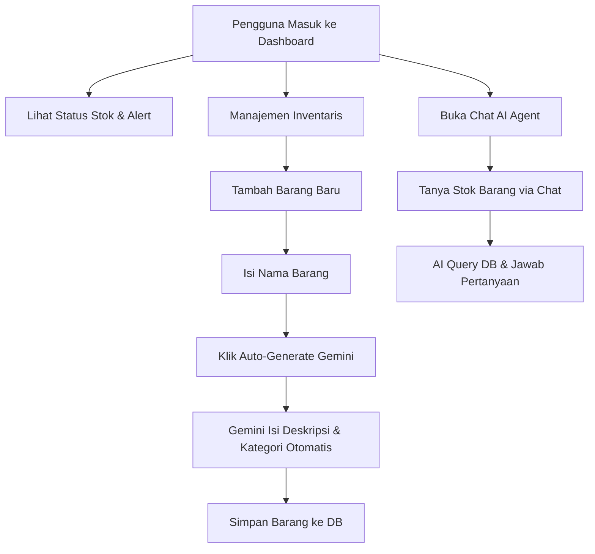

# Product Requirement Document (PRD) - Smart Inventory System

## 1. Pendahuluan & Latar Belakang
Sistem inventaris konvensional seringkali membutuhkan input data manual yang tinggi dan lambat dalam memberikan insight analitis mengenai tingkat persediaan barang. Proyek ini bertujuan membangun **Smart Inventory System** menggunakan stack modern Next.js dan Go, yang ditenagai oleh database PostgreSQL serta diintegrasikan dengan Google Gemini AI untuk memberikan fitur otomatisasi pintar dan interaksi berbasis agen AI.

## 2. Tujuan & Sasaran
* **Efisiensi Input**: Mengurangi proses manual dalam pembuatan deskripsi barang dan kategori menggunakan AI (Gemini).
* **AI Chat Assistant**: Memungkinkan pengguna bertanya tentang kondisi stok, mencari barang, dan mendapatkan rekomendasi restock menggunakan bahasa alami.
* **Performa Tinggi**: Menggunakan Go (Backend) untuk respons API yang sangat cepat dan Next.js (Frontend) untuk UI yang responsif dan mulus.

## 3. Fitur Utama (Core Features)

### 3.1. Dashboard & Analitik
* Ringkasan stok total, total nilai aset inventaris, dan jumlah kategori.
* Alarm Stok Rendah (Low Stock Alerts) untuk mendeteksi barang yang berada di bawah ambang batas minimum.
* Grafik atau ringkasan transaksi stok masuk/keluar harian.

### 3.2. Manajemen Produk (CRUD)
* **Buat/Edit Produk**: Nama, SKU (Generated/Manual), Kategori, Deskripsi, Kuantitas, Harga Beli, Harga Jual, Ambang Batas Minimum (Low Stock Threshold).
* **Gemini Helper**: Tombol "Auto-Generate" untuk kategori dan deskripsi berdasarkan nama produk.

### 3.3. Transaksi Stok (Stock Ledger)
* Pencatatan riwayat penambahan stok (Stock In) dan pengurangan stok (Stock Out).
* Pencatatan catatan/keterangan transaksi (misal: "Pembelian dari Supplier A", "Penjualan ke Pelanggan B").

### 3.4. AI Agent & Gemini Skills
* **Chatbot Inventaris**:
  - Mengerti bahasa alami (Indonesia/Inggris).
  - Bisa menjawab pertanyaan seperti:
    - *"Tunjukkan barang apa saja yang hampir habis."*
    - *"Berapa total nilai barang di kategori Elektronik?"*
    - *"Berikan rekomendasi barang yang harus dibeli ulang."*
  - Mengambil data real-time dari database PostgreSQL melalui semantic search/API Calls (Tool Use/Function Calling).

## 4. Persyaratan Non-Fungsional (Non-Functional Requirements)
* **Kinerja**: Waktu respons API Go untuk operasi CRUD rata-rata < 100ms.
* **Keamanan**: Proteksi input database dari SQL Injection, sanitasi data di frontend.
* **Kemudahan Development**: Dapat dijalankan di mesin lokal hanya dengan `docker compose` dan perintah sederhana `npm run dev` (atau script penggabung backend-frontend).
* **UI/UX Premium**: Desain modern menggunakan visual yang mewah (curated color palette, responsive, hover animations).

## 5. Alur Pengguna (User Flow)

