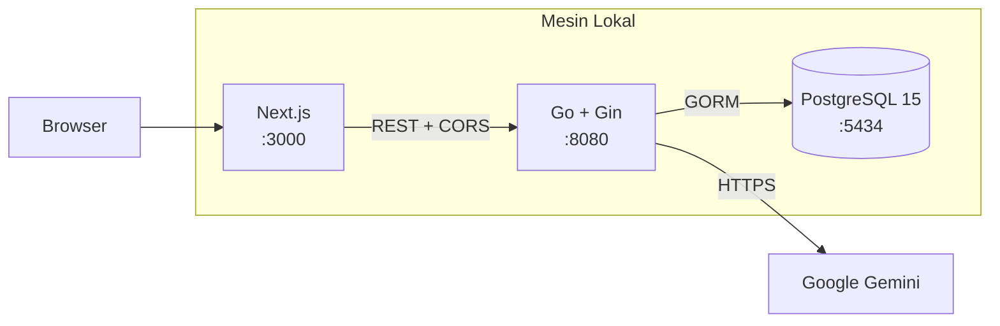
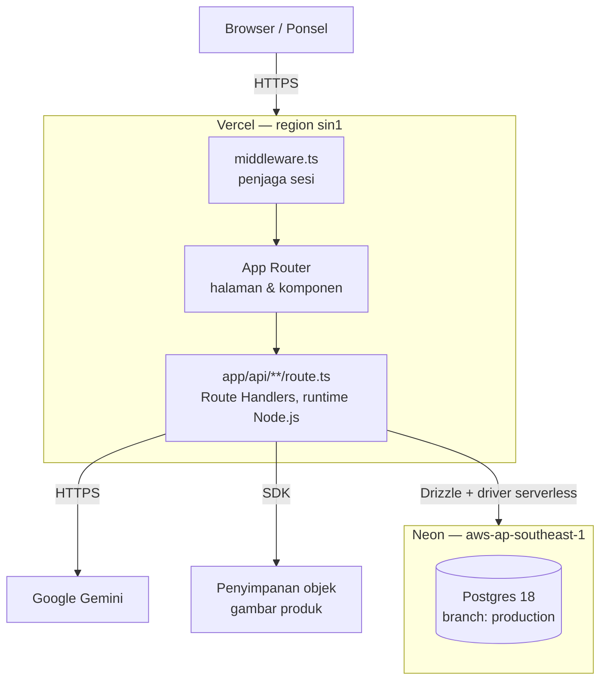
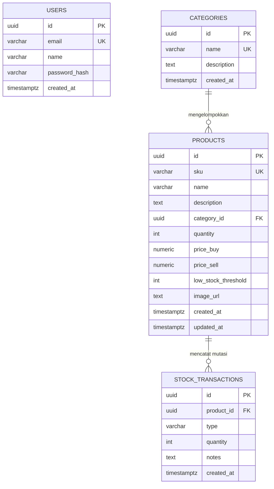
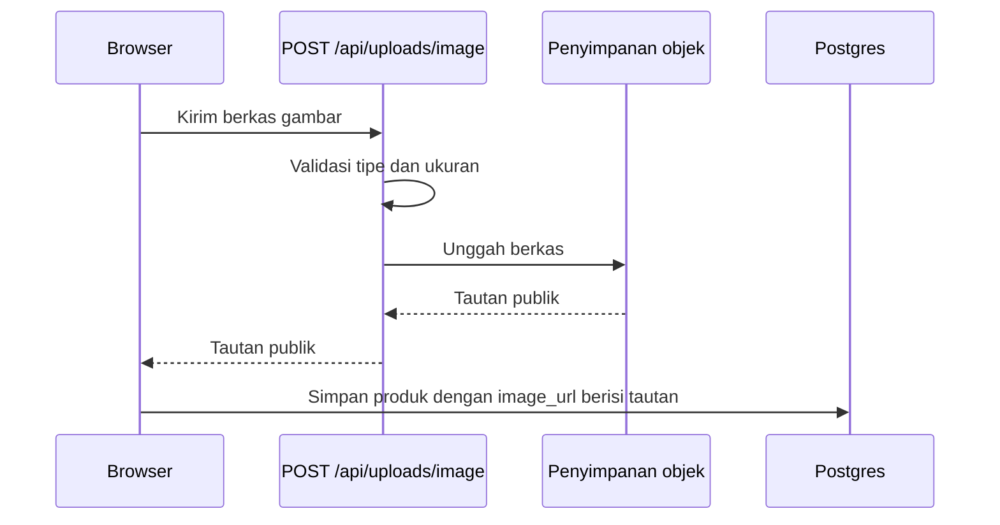
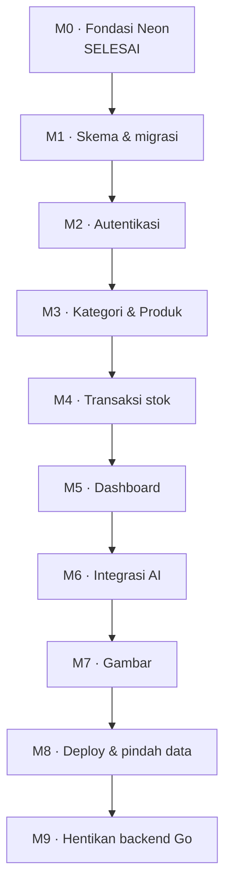

# Technical Requirement Document (TRD)
## Smart Inventory System

| Field | Nilai |
|---|---|
| Versi dokumen | 1.0 |
| Tanggal | 3 Oktober 2026 |
| Status | Draft untuk review |
| Menggantikan | [DESIGN.md](DESIGN.md) sebagai sumber kebenaran arsitektur |
| Dokumen terkait | [BRD.md](BRD.md) · [PRD.md](PRD.md) · [FRD.md](FRD.md) |

---

## 1. Ringkasan Teknis

Dokumen ini menetapkan arsitektur target sistem: aplikasi Next.js tunggal yang di-deploy ke Vercel, dengan seluruh logika backend berpindah dari Go ke Route Handlers TypeScript, dan basis data pada Neon Postgres yang sudah disediakan.

**Keputusan arsitektur utama:** backend Go dihentikan dan ditulis ulang sebagai bagian dari aplikasi Next.js. Alasannya bersifat struktural — Vercel menjalankan fungsi yang dipanggil per permintaan, bukan proses server yang hidup terus-menerus. Mempertahankan Gin berarti memakai runtime komunitas, menanggung cold start yang lebih berat, dan tetap harus merombak inisialisasi basis data. Menyatukan semuanya ke dalam satu aplikasi Next.js menghilangkan CORS, menghilangkan koordinasi dua deployment, dan menjadikan setiap perubahan satu kali push.

---

## 2. Arsitektur

### 2.1 Arsitektur saat ini



Tiga kontainer Docker, tiga port, komunikasi lintas origin, hanya dapat diakses dari mesin yang menjalankannya.

### 2.2 Arsitektur target



Satu project, satu deployment, satu origin. Browser tidak pernah berbicara langsung dengan basis data maupun Gemini.

### 2.3 Alasan penempatan region

Project Neon berada di `aws-ap-southeast-1` (Singapura). Secara baku, fungsi Vercel dieksekusi di region Amerika Serikat. Bila dibiarkan, setiap kueri basis data menempuh perjalanan bolak-balik lintas Pasifik — dan satu permintaan API biasanya memicu beberapa kueri, sehingga penaltinya berlipat.

**Requirement:** konfigurasikan region fungsi Vercel ke Singapura (`sin1`) agar sejalan dengan region basis data. Ini adalah satu baris konfigurasi dengan dampak latensi yang besar, dan merupakan salah satu kesalahan paling umum pada deployment serverless.

---

## 3. Tumpukan Teknologi

### 3.1 Saat ini

| Lapisan | Teknologi | Versi |
|---|---|---|
| Frontend | Next.js, React, Tailwind CSS | 16.2.10, 19.2.4, v4 |
| Ikon | lucide-react | ^1.25.0 |
| Backend | Go, Gin, GORM | 1.25.0, 1.12.0, 1.31.2 |
| Basis data | PostgreSQL | 15 (kontainer) |
| AI | google/generative-ai-go, model gemini-1.5-flash | 0.20.1 |
| Autentikasi | golang-jwt/jwt, bcrypt | v5.3.1 |
| Orkestrasi | Docker Compose | — |

### 3.2 Target

| Lapisan | Teknologi | Alasan pemilihan |
|---|---|---|
| Aplikasi | Next.js 16 App Router | Sudah dipakai; menyatukan UI dan API |
| Runtime API | Route Handlers, runtime Node.js | Edge tidak mendukung driver Postgres dan pustaka hash kata sandi yang dibutuhkan |
| ORM | Drizzle ORM | SQL-first, jejak memori kecil, cocok untuk cold start |
| Driver basis data | `@neondatabase/serverless` | Dirancang untuk lingkungan serverless |
| Migrasi | drizzle-kit | Berkas migrasi yang dapat ditinjau, menggantikan migrasi otomatis saat boot |
| Autentikasi | `jose` untuk JWT | Berbasis Web Crypto, berjalan di Node maupun Edge middleware |
| Hash kata sandi | `bcryptjs` | Murni JavaScript, tanpa binding native yang rapuh di serverless |
| AI | `@google/genai` | SDK resmi generasi terbaru |
| Penyimpanan gambar | Penyimpanan objek | Menghentikan penyimpanan base64 di dalam basis data |
| Validasi | `zod` | Menggantikan tag binding Gin dengan skema yang dapat dipakai ulang di klien |
| Basis data | Neon Postgres 18 | Sudah disediakan |

### 3.3 Catatan ketidaksesuaian versi pada sistem saat ini

Berkas `go.mod` menyatakan `go 1.25.0`, sementara [backend/Dockerfile](../backend/Dockerfile) membangun dengan `golang:1.23-alpine` dan mengandalkan `GOTOOLCHAIN=auto` untuk mengunduh toolchain yang sesuai saat proses build. Ini berhasil, tetapi membuat build bergantung pada jaringan dan lebih lambat dari semestinya. Masalah ini hilang dengan sendirinya setelah migrasi, dan dicatat di sini agar tidak membingungkan bila ada yang perlu membangun ulang versi Go sebelum migrasi selesai.

---

## 4. Infrastruktur Neon — Kondisi Nyata

Project sudah dibuat, di-link ke direktori kerja, dan kebijakannya sudah diterapkan.

| Properti | Nilai |
|---|---|
| Nama project | `inventory` |
| ID project | `summer-queen-33571031` |
| ID organisasi | `org-shiny-leaf-27648606` |
| Region | `aws-ap-southeast-1` (Singapura) |
| Versi Postgres | **18** |
| Branch | `production` (`br-late-truth-azrc9so2`), branch baku, tidak berstatus protected |
| Basis data | `neondb` |
| Role pemilik | `neondb_owner` |
| Layanan tambahan tersedia | AI gateway, penyimpanan objek |

### 4.1 Berkas konfigurasi di repositori

| Berkas | Isi | Masuk git? |
|---|---|---|
| `neon.ts` | Kebijakan branch, saat ini `defineConfig({})` | Ya |
| `.neon` | Penanda project, organisasi, dan branch aktif | Tidak — sudah di `.gitignore` |
| `.env.local` | `DATABASE_URL`, `DATABASE_URL_UNPOOLED`, `NEON_BRANCH` | Tidak — sudah di `.gitignore` |

Isi `neon.ts` saat ini:
```ts
import { defineConfig } from "@neon/config/v1";

export default defineConfig({});
```

Kebijakan kosong berarti branch memakai pengaturan baku project. `neon deploy` terhadap kebijakan ini melaporkan "No changes" — tidak ada sumber daya yang diubah maupun dihapus.

### 4.2 Perintah operasional

| Perintah | Kegunaan |
|---|---|
| `neon status` | Menampilkan keadaan branch yang sebenarnya di Neon |
| `neon config plan` | Pratinjau perubahan sebelum diterapkan |
| `neon deploy` | Menerapkan `neon.ts` ke branch |
| `neon connection-string` | Mengambil string koneksi |
| `neon branches list` | Melihat daftar branch |
| `neon psql` | Membuka sesi psql ke branch aktif |

### 4.3 Strategi branch basis data

Neon mendukung branch basis data yang berperilaku mirip branch git — salinan dengan mekanisme copy-on-write.

| Lingkungan | Branch Neon | Kegunaan |
|---|---|---|
| Produksi | `production` | Data nyata, dipakai deployment produksi Vercel |
| Pratinjau | Branch sementara per-cabang-git | Menguji migrasi terhadap struktur data nyata tanpa menyentuh produksi |
| Lokal | Branch pengembangan | Pekerjaan sehari-hari |

Kebijakan pada `neon.ts` hasil scaffolding memberi branch non-baku masa berlaku otomatis. Kebijakan itu sengaja disederhanakan menjadi kosong pada versi ini; bila branch pratinjau nanti dipakai, kebijakan kedaluwarsa sebaiknya dikembalikan agar branch terbengkalai tidak menumpuk dan memakan kuota.

### 4.4 Koneksi dan pooling

| Variabel | Kapan dipakai |
|---|---|
| `DATABASE_URL` | Jalur **berpooling**. Dipakai seluruh kode aplikasi |
| `DATABASE_URL_UNPOOLED` | Koneksi langsung. Hanya untuk migrasi dan operasi administratif |

Fungsi serverless dapat dijalankan dalam banyak instance sekaligus. Tanpa pooling, setiap instance membuka koneksinya sendiri dan batas koneksi Postgres akan tercapai dengan cepat di bawah beban. **Kode aplikasi wajib memakai `DATABASE_URL`.** Perintah migrasi memakai versi tanpa pooling karena pernyataan DDL memerlukan sesi yang stabil.

### 4.5 Autosuspend

Neon menghentikan compute yang menganggur. Kueri pertama setelah periode idle akan membangunkannya, sehingga terasa lebih lambat dari kueri berikutnya. Perilaku ini melekat pada free tier dan dapat diterima untuk pemakaian internal.

Mitigasi yang masuk akal: tampilkan indikator proses pada pemuatan data pertama. Mitigasi yang **tidak** disarankan: menjadwalkan ping berkala untuk menjaga basis data tetap hidup — itu membakar jam compute untuk masalah yang sebenarnya dapat diterima.

---

## 5. Skema Basis Data

### 5.1 Diagram relasi



### 5.2 DDL

Ditulis untuk PostgreSQL 18. Fungsi `gen_random_uuid()` tersedia bawaan sejak Postgres 13 — ekstensi `pgcrypto` yang dipanggil pada [docs/seed.sql](seed.sql) tidak lagi diperlukan.

```sql
-- ── users ───────────────────────────────────────────────
CREATE TABLE IF NOT EXISTS users (
  id            UUID PRIMARY KEY DEFAULT gen_random_uuid(),
  email         VARCHAR(255) NOT NULL UNIQUE,
  name          VARCHAR(255) NOT NULL,
  password_hash TEXT         NOT NULL,
  created_at    TIMESTAMPTZ  NOT NULL DEFAULT now()
);

-- ── categories ──────────────────────────────────────────
CREATE TABLE IF NOT EXISTS categories (
  id          UUID PRIMARY KEY DEFAULT gen_random_uuid(),
  name        VARCHAR(100) NOT NULL UNIQUE,
  description TEXT         NOT NULL DEFAULT '',
  created_at  TIMESTAMPTZ  NOT NULL DEFAULT now()
);

-- ── products ────────────────────────────────────────────
CREATE TABLE IF NOT EXISTS products (
  id                  UUID PRIMARY KEY DEFAULT gen_random_uuid(),
  sku                 VARCHAR(64)  NOT NULL UNIQUE,
  name                VARCHAR(255) NOT NULL,
  description         TEXT         NOT NULL DEFAULT '',
  category_id         UUID         NOT NULL
                        REFERENCES categories(id) ON DELETE RESTRICT,
  quantity            INTEGER      NOT NULL DEFAULT 0,
  price_buy           NUMERIC(12,2) NOT NULL DEFAULT 0,
  price_sell          NUMERIC(12,2) NOT NULL DEFAULT 0,
  low_stock_threshold INTEGER      NOT NULL DEFAULT 5,
  image_url           TEXT         NOT NULL DEFAULT '',
  created_at          TIMESTAMPTZ  NOT NULL DEFAULT now(),
  updated_at          TIMESTAMPTZ  NOT NULL DEFAULT now(),

  CONSTRAINT products_quantity_non_negative  CHECK (quantity >= 0),
  CONSTRAINT products_threshold_non_negative CHECK (low_stock_threshold >= 0),
  CONSTRAINT products_price_buy_non_negative CHECK (price_buy  >= 0),
  CONSTRAINT products_price_sell_non_negative CHECK (price_sell >= 0)
);

CREATE INDEX IF NOT EXISTS idx_products_category_id ON products(category_id);
CREATE INDEX IF NOT EXISTS idx_products_low_stock
  ON products(quantity) WHERE quantity <= low_stock_threshold;

-- ── stock_transactions ──────────────────────────────────
CREATE TABLE IF NOT EXISTS stock_transactions (
  id         UUID PRIMARY KEY DEFAULT gen_random_uuid(),
  product_id UUID        NOT NULL
               REFERENCES products(id) ON DELETE CASCADE,
  type       VARCHAR(3)  NOT NULL,
  quantity   INTEGER     NOT NULL,
  notes      TEXT        NOT NULL DEFAULT '',
  created_at TIMESTAMPTZ NOT NULL DEFAULT now(),

  CONSTRAINT stock_tx_type_valid     CHECK (type IN ('IN','OUT')),
  CONSTRAINT stock_tx_quantity_positive CHECK (quantity > 0)
);

CREATE INDEX IF NOT EXISTS idx_stock_tx_product_id  ON stock_transactions(product_id);
CREATE INDEX IF NOT EXISTS idx_stock_tx_created_at  ON stock_transactions(created_at DESC);

-- ── updated_at otomatis ─────────────────────────────────
CREATE OR REPLACE FUNCTION set_updated_at() RETURNS TRIGGER AS $$
BEGIN
  NEW.updated_at = now();
  RETURN NEW;
END;
$$ LANGUAGE plpgsql;

CREATE OR REPLACE TRIGGER products_set_updated_at
  BEFORE UPDATE ON products
  FOR EACH ROW EXECUTE FUNCTION set_updated_at();
```

### 5.3 Perubahan dari skema saat ini

| Perubahan | Alasan |
|---|---|
| `CHECK (quantity >= 0)` pada produk | Memenuhi FR-TRX-11 pada lapisan basis data, bukan hanya lapisan aplikasi |
| `CHECK (type IN ('IN','OUT'))` | Saat ini hanya divalidasi di kode Go; basis data menerima nilai apa pun |
| `CHECK (quantity > 0)` pada transaksi | Mencegah transaksi bernilai nol atau negatif |
| Foreign key `ON DELETE CASCADE` | Menggantikan penghapusan manual di `DeleteProduct`; mustahil meninggalkan transaksi yatim |
| Foreign key `ON DELETE RESTRICT` pada kategori | Memenuhi FR-CAT-05 |
| Indeks pada `category_id` | Setiap pengambilan produk melakukan join ke kategori |
| Indeks parsial untuk stok rendah | Kueri dashboard yang paling sering dijalankan |
| Indeks pada `created_at DESC` | Riwayat selalu diurutkan dari yang terbaru |
| `name` kategori menjadi unik | Memenuhi FR-CAT-06; juga memperbaiki pencocokan kategori hasil saran AI |
| Seluruh kolom teks `NOT NULL DEFAULT ''` | Menghapus kerancuan antara nilai kosong dan nilai tidak diketahui |
| Trigger `updated_at` | Saat ini dikelola GORM; dipindah ke basis data agar tetap benar apa pun kliennya |

### 5.4 Perkiraan kapasitas

Perkiraan kasar ukuran baris, tanpa indeks:

| Tabel | Perkiraan ukuran per baris | 1.000 baris | 10.000 baris |
|---|---|---|---|
| `users` | ~200 B | 200 KB | — |
| `categories` | ~300 B | 300 KB | — |
| `products` dengan tautan gambar | ~600 B | 600 KB | 6 MB |
| `products` dengan base64 **(kondisi saat ini)** | **~270 KB** | **270 MB** | **2,7 GB** |
| `stock_transactions` | ~250 B | 250 KB | 2,5 MB |

Angka ini menunjukkan mengapa FR-PROD-09 berstatus wajib, bukan sekadar penyempurnaan. Dengan tautan gambar, sepuluh ribu produk memakai beberapa megabita dan free tier sangat longgar. Dengan base64, seribu produk saja sudah cukup untuk menghabiskan kuota penyimpanan.

> Verifikasi kuota penyimpanan free tier yang berlaku pada dashboard Neon sebelum perencanaan kapasitas — angkanya dapat berubah.

### 5.5 Migrasi dan seeding

Mekanisme saat ini — `AutoMigrate` ditambah penanaman data admin dan kategori — dijalankan pada setiap kali proses dinyalakan, di [backend/internal/config/db.go](../backend/internal/config/db.go). Dalam model serverless, "setiap kali dinyalakan" berarti setiap cold start: puluhan hingga ratusan kali per hari, masing-masing memeriksa struktur tabel dan menghitung baris sebelum melayani permintaan pertama.

| Aspek | Saat ini | Target |
|---|---|---|
| Perubahan struktur | `AutoMigrate` saat boot | Berkas migrasi drizzle-kit, dijalankan sengaja |
| Penanaman data | Fungsi seed saat boot | Skrip `npm run db:seed`, dijalankan sekali |
| Koneksi | Langsung | Tanpa pooling untuk migrasi, berpooling untuk aplikasi |
| Dapat ditinjau | Tidak — perubahan tersirat dari struktur data | Ya — berkas SQL masuk kontrol versi |

**Kredensial admin awal.** Sistem saat ini menanam `admin@example.com` dengan kata sandi `password123` yang tertulis langsung di dalam kode. Kredensial ini tidak boleh ikut ke produksi. Skrip seed versi target harus membaca email dan kata sandi admin dari environment variable, dan menolak berjalan bila keduanya tidak tersedia.

### 5.6 Pemindahan data

```bash
# 1. Ambil salinan dari basis data lokal
pg_dump --no-owner --no-acl \
  -h localhost -p 5434 -U postgres -d inventory \
  > backup_lokal.sql

# 2. Terapkan skema target di Neon lewat migrasi
npm run db:migrate

# 3. Muat hanya isi tabel, bukan strukturnya
#    Periksa dahulu apakah kolom image_url berisi data URL base64 —
#    bila ya, pindahkan gambar ke penyimpanan objek sebelum langkah ini.

# 4. Verifikasi jumlah baris pada kedua sisi
```

Verifikasi wajib: jumlah baris pada `categories`, `products`, dan `stock_transactions` harus sama persis antara sumber dan tujuan sebelum basis data lokal dianggap tidak lagi diperlukan.

---

## 6. Desain Autentikasi

### 6.1 Perbandingan

| Aspek | Saat ini | Target |
|---|---|---|
| Penyimpanan token | `localStorage` | Cookie `httpOnly`, `Secure`, `SameSite=Lax` |
| Penjaga rute | Komponen klien setelah halaman dimuat | `middleware.ts`, sebelum halaman dikirim |
| Rahasia penandatanganan | Environment variable dengan cadangan di dalam kode | Environment variable saja; proses gagal bila tidak ada |
| Pustaka | `golang-jwt/jwt` | `jose` |
| Hash kata sandi | `bcrypt` Go | `bcryptjs` |
| Masa berlaku | 24 jam | 24 jam, tidak berubah |

### 6.2 Alur

```mermaid
sequenceDiagram
    participant B as Browser
    participant M as middleware.ts
    participant R as Route Handler
    participant D as Neon Postgres

    B->>R: POST /api/auth/login
    R->>D: Ambil pengguna berdasarkan email
    D-->>R: Baris pengguna beserta hash
    R->>R: Bandingkan kata sandi dengan hash
    R->>R: Tanda tangani JWT
    R-->>B: Set-Cookie httpOnly; Secure; SameSite=Lax
    Note over B: Token tidak dapat dibaca JavaScript

    B->>M: GET /products
    M->>M: Verifikasi tanda tangan & masa berlaku
    alt Token sah
        M->>B: Lanjutkan ke halaman
    else Token tidak sah
        M-->>B: Alihkan ke /login
    end
```

Perbedaan penting: penjaga saat ini berjalan **setelah** halaman dikirim ke browser, sehingga sekilas isi halaman sempat tampil sebelum pengalihan terjadi. Middleware memutuskan **sebelum** halaman dikirim.

### 6.3 Requirement

| ID | Requirement |
|---|---|
| TR-AUTH-01 | `JWT_SECRET` wajib ada; aplikasi gagal saat startup bila tidak tersedia, tanpa nilai cadangan apa pun |
| TR-AUTH-02 | Cookie sesi wajib bersifat `httpOnly` dan `Secure` |
| TR-AUTH-03 | Penjagaan rute dilakukan di middleware, bukan di komponen klien |
| TR-AUTH-04 | Hash kata sandi tidak pernah masuk ke respons API maupun log |
| TR-AUTH-05 | Kegagalan masuk menghasilkan pesan identik untuk email tidak dikenal dan kata sandi salah |
| TR-AUTH-06 | Endpoint keluar menghapus cookie di sisi server |

---

## 7. Konkurensi Transaksi Stok

Perbaikan untuk FR-TRX-05. Pola yang benar menyatukan pemeriksaan dan pembaruan ke dalam satu pernyataan, sehingga Postgres yang menjamin keamanannya:

```sql
-- Satu pernyataan: memeriksa dan mengurangi sekaligus.
-- Nol baris terpengaruh berarti stok tidak mencukupi.
UPDATE products
   SET quantity = quantity - $1
 WHERE id = $2
   AND quantity >= $1
RETURNING quantity;
```

Logikanya dalam satu transaksi basis data:

```
BEGIN
  jalankan UPDATE di atas
  jika tidak ada baris terpengaruh:
     ROLLBACK, kembalikan 400 "Stok tidak mencukupi"
  sisipkan baris stock_transactions
COMMIT
```

Transaksi `IN` memakai pola serupa tanpa klausa perbandingan. Lapisan terakhir dijaga oleh batasan `CHECK (quantity >= 0)` di basis data: seandainya ada jalur kode yang terlewat, basis data tetap menolak hasil yang negatif.

---

## 8. Integrasi AI

### 8.1 Rancangan

| Aspek | Keputusan |
|---|---|
| Model | `gemini-1.5-flash` — cepat dan hemat; dapat ditinjau ulang bila kualitas kurang memadai |
| Pustaka | `@google/genai` |
| Pemanggilan fungsi | Dipertahankan — tiga tool hanya-baca |
| Pelaksana tool | Route Handler, memakai kueri Drizzle |
| Mode kegagalan | Tanpa kunci API, kembalikan pesan penjelasan; jangan jatuhkan permintaan |
| Jalur kredensial | Kunci API hanya di sisi server; tidak pernah dikirim ke browser |

### 8.2 Batas putaran pemanggilan tool

Implementasi saat ini pada [backend/internal/service/gemini.go](../backend/internal/service/gemini.go) memakai perulangan `for` tanpa batas atas: model memanggil tool, hasilnya dikirim balik, dan proses berulang selama model masih meminta tool.

Pada server yang berjalan terus-menerus, perulangan yang tidak kunjung selesai hanya membuang sumber daya. Pada fungsi serverless dengan batas durasi eksekusi, perulangan tersebut akan menabrak batas waktu dan menghasilkan kegagalan yang membingungkan bagi pengguna.

**Requirement TR-AI-01:** batasi jumlah putaran pemanggilan tool — lima putaran sudah lebih dari cukup untuk ketiga tool yang tersedia — dan kembalikan jawaban parsial yang sopan bila batas tercapai.

### 8.3 Catatan tentang Neon AI Gateway

Project Neon ini sudah memiliki kredensial AI gateway. Jalur tersebut dapat dipertimbangkan untuk menyatukan pengelolaan kredensial AI di satu penyedia. Namun jalur langsung ke Google Gemini sudah berjalan dan terbukti, sehingga **tidak ada perubahan yang disarankan pada versi ini**. Dicatat di sini sebagai opsi yang tersedia, bukan rekomendasi.

---

## 9. Penyimpanan Gambar

### 9.1 Masalah

Formulir produk mengubah berkas gambar menjadi data URL base64 dan menyimpannya di kolom `image_url` ([frontend/src/app/products/page.tsx:145-149](../frontend/src/app/products/page.tsx#L145-L149)). Konsekuensinya berlapis: baris basis data membengkak sekitar 450 kali lipat, setiap pengambilan daftar produk mengirimkan seluruh gambar, browser tidak dapat menyimpan gambar di cache secara terpisah, dan kuota penyimpanan free tier habis jauh lebih cepat dari yang diperkirakan.

### 9.2 Rancangan target



| Requirement | Keterangan |
|---|---|
| TR-IMG-01 | Gambar disimpan di penyimpanan objek; basis data hanya menyimpan tautan |
| TR-IMG-02 | Validasi tipe berkas di sisi server, bukan hanya atribut `accept` pada formulir |
| TR-IMG-03 | Tetapkan batas ukuran berkas dan tolak unggahan yang melebihinya |
| TR-IMG-04 | Data base64 yang sudah terlanjur tersimpan dipindahkan sebagai bagian dari migrasi data |

**Pilihan penyedia.** Project Neon sudah memiliki kredensial penyimpanan objek, sehingga seluruh data berada pada satu penyedia. Vercel Blob merupakan alternatif dengan integrasi yang lebih erat ke Next.js. Keduanya memenuhi requirement; keputusan akhir diambil saat implementasi dan tidak memengaruhi bagian lain dari rancangan ini, karena yang disimpan di basis data hanyalah sebuah tautan.

---

## 10. Environment Variable

| Variabel | Lingkungan | Sumber | Wajib | Kegunaan |
|---|---|---|---|---|
| `DATABASE_URL` | Semua | Neon, berpooling | Ya | Seluruh kueri aplikasi |
| `DATABASE_URL_UNPOOLED` | Semua | Neon, langsung | Ya | Migrasi dan tugas administratif |
| `NEON_BRANCH` | Semua | Neon | Tidak | Keterangan branch aktif |
| `JWT_SECRET` | Semua | Dibuat sendiri, acak | **Ya** | Penandatanganan token; **tanpa nilai cadangan** |
| `GEMINI_API_KEY` | Semua | Google AI Studio | Tidak | Fitur AI; tanpa ini sistem memakai mode cadangan |
| `ADMIN_EMAIL` | Seeding | Ditentukan operator | Ya saat seeding | Akun admin awal |
| `ADMIN_PASSWORD` | Seeding | Ditentukan operator | Ya saat seeding | Kata sandi admin awal |
| Kredensial penyimpanan | Semua | Penyedia terpilih | Ya | Unggahan gambar |

**Aturan.** Seluruh variabel di atas adalah variabel sisi server. Tidak satu pun boleh diberi awalan `NEXT_PUBLIC_`, karena awalan tersebut menyisipkan nilainya ke dalam berkas JavaScript yang diunduh browser. Variabel `NEXT_PUBLIC_API_URL` yang dipakai sistem saat ini menjadi tidak relevan setelah API berada pada origin yang sama.

---

## 11. Batasan Vercel Hobby

| Batasan | Dampak pada sistem ini | Mitigasi |
|---|---|---|
| Durasi eksekusi fungsi dibatasi | Perulangan pemanggilan tool AI berisiko melewatinya | TR-AI-01: batasi jumlah putaran |
| Jumlah fungsi per deployment dibatasi | Route Handlers Next.js digabungkan, sehingga jarang menjadi masalah | Pantau jumlah fungsi saat build |
| Bandwidth bulanan dibatasi | Gambar base64 adalah pemborosnya | TR-IMG-01 menyelesaikan ini |
| Penggunaan komersial dilarang | Batasan bisnis, bukan teknis | Lihat [BRD.md](BRD.md) bagian model biaya |
| Region fungsi tunggal | Harus disejajarkan dengan region basis data | Tetapkan region ke Singapura |
| Tanpa cron job | Tidak ada fitur yang membutuhkannya saat ini | — |

> Angka pasti untuk setiap batasan di atas sengaja tidak dicantumkan karena berubah sewaktu-waktu. Periksa dokumentasi dan dashboard Vercel yang berlaku sebelum merencanakan kapasitas.

---

## 12. Requirement Non-Fungsional

| ID | Requirement | Target | Cara mengukur |
|---|---|---|---|
| NFR-01 | Waktu muat dashboard | < 2 detik pada kondisi hangat | Lighthouse |
| NFR-02 | Waktu respons API untuk operasi dasar | < 300 ms pada kondisi hangat | Log Vercel |
| NFR-03 | Permintaan pertama setelah idle | < 3 detik termasuk pembangunan compute | Pengukuran manual |
| NFR-04 | Daftar produk tetap responsif | Hingga 10.000 produk dengan paginasi | Uji beban |
| NFR-05 | Dapat dipakai di ponsel | Seluruh alur selesai pada lebar 360 px | Pengujian perangkat |
| NFR-06 | Seluruh lalu lintas terenkripsi | HTTPS wajib | Otomatis dari Vercel |
| NFR-07 | Tidak ada rahasia di repositori | Nol temuan | `git log -p` dan pemindaian rahasia |
| NFR-08 | Basis data dapat dipulihkan | Point-in-time restore aktif | Dashboard Neon |

---

## 13. Pengerasan Keamanan

Setiap butir memetakan temuan nyata pada kode saat ini ke tindakan perbaikan.

| # | Temuan | Lokasi | Tingkat | Perbaikan |
|---|---|---|---|---|
| S-1 | Rahasia JWT punya nilai cadangan di dalam kode | [auth.go:20](../backend/internal/handler/auth.go#L20) | **Kritis** | Wajib dari environment; gagal saat startup bila tidak ada |
| S-2 | `Allow-Origin: *` digabung `Allow-Credentials: true` | [main.go:24](../backend/cmd/api/main.go#L24) | Tinggi | CORS dihapus seluruhnya setelah menjadi satu origin |
| S-3 | Token sesi dapat dibaca JavaScript | [api.ts](../frontend/src/lib/api.ts) | Tinggi | Cookie `httpOnly` |
| S-4 | Pemeriksaan stok di luar transaksi | [handler.go:240-259](../backend/internal/handler/handler.go#L240-L259) | Tinggi | Satu pernyataan `UPDATE` bersyarat, ditambah batasan `CHECK` |
| S-5 | Kredensial admin tertulis di dalam kode | [db.go](../backend/internal/config/db.go) | Tinggi | Seeding membaca dari environment |
| S-6 | Pembaruan parsial mengosongkan kolom | [handler.go:126](../backend/internal/handler/handler.go#L126) | Sedang | Semantik pembaruan parsial yang benar |
| S-7 | Tidak ada pembatasan laju pada endpoint masuk | [auth.go:89](../backend/internal/handler/auth.go#L89) | Sedang | Pembatasan laju berbasis alamat IP |
| S-8 | Tidak ada pembatasan laju pada endpoint AI | [handler.go:318](../backend/internal/handler/handler.go#L318) | Sedang | Pembatasan laju per pengguna agar kuota tidak terkuras |
| S-9 | Pesan kesalahan basis data diteruskan apa adanya | Beberapa handler | Rendah | Pesan umum untuk pengguna; detail hanya ke log |
| S-10 | Unggahan gambar tidak divalidasi di server | [products/page.tsx](../frontend/src/app/products/page.tsx) | Sedang | Validasi tipe dan ukuran di sisi server |

**Praktik yang sudah benar pada sistem saat ini dan harus dipertahankan:** hash kata sandi tidak pernah diserialisasi karena ditandai `json:"-"` pada model; berkas `.env` tidak masuk kontrol versi; GORM memakai kueri berparameter sehingga aman dari injeksi SQL; respons 401 sudah ditangani dengan membersihkan sesi dan mengalihkan ke halaman masuk.

---

## 14. Rencana Migrasi

Migrasi dilakukan bertahap per modul. Setiap langkah berdiri sendiri dan dapat diverifikasi sebelum melanjutkan.



| Tahap | Lingkup | Kriteria selesai |
|---|---|---|
| **M0** | Project Neon dibuat, di-link, `neon.ts` diterapkan | ✅ `neon status` menampilkan branch `production` yang sehat |
| **M1** | Skema Drizzle, berkas migrasi, skrip seed | Migrasi berjalan pada branch bersih; seluruh tabel, indeks, dan batasan terbentuk |
| **M2** | Masuk, keluar, middleware, endpoint identitas | Masuk menetapkan cookie `httpOnly`; rute terlindungi mengalihkan pengguna tanpa sesi |
| **M3** | CRUD kategori dan produk, pembuatan SKU, paginasi | Seluruh operasi berjalan; pembaruan parsial tidak mengosongkan kolom |
| **M4** | Transaksi stok dengan pembaruan atomik | Dua permintaan `OUT` bersamaan tidak membuat stok negatif |
| **M5** | Endpoint ringkasan dashboard | Indikator cocok dengan perhitungan lama; browser tidak lagi mengunduh seluruh tabel |
| **M6** | Saran produk dan chat, dengan batas putaran tool | Jawaban AI memakai data nyata; perulangan berhenti pada batas yang ditetapkan |
| **M7** | Unggahan ke penyimpanan objek, migrasi gambar base64 | Tidak ada lagi data URL di kolom `image_url` |
| **M8** | Deploy ke Vercel, pindahkan data produksi | Aplikasi dapat diakses publik; jumlah baris cocok dengan sumber |
| **M9** | Hapus direktori backend dan Docker Compose | Repositori hanya berisi aplikasi Next.js |

**Catatan urutan.** M1 hingga M7 dapat dikerjakan sementara backend Go masih berjalan — keduanya menunjuk basis data yang sama, sehingga pekerjaan dapat diverifikasi secara bertahap. M9 dilakukan hanya setelah M8 terbukti stabil, agar jalur kembali ke sistem lama tetap terbuka bila terjadi masalah.

---

## 15. Strategi Pengujian

| Lapisan | Cakupan | Perkakas |
|---|---|---|
| Unit | Pembuatan SKU, perhitungan nilai aset, penentuan stok rendah, penandatanganan token | Vitest |
| Integrasi | Route Handlers terhadap branch Neon khusus pengujian | Vitest + branch uji |
| Konkurensi | Transaksi `OUT` bersamaan tidak membuat stok negatif | Skrip khusus |
| Migrasi | Migrasi berjalan bersih pada basis data kosong | drizzle-kit pada branch sementara |
| Ujung ke ujung | Masuk → tambah produk → catat transaksi → periksa dashboard | Playwright |
| Manual | Chat AI, unggah gambar, tampilan ponsel | Daftar periksa |

Berkas uji yang sudah ada di backend Go — `model_test.go`, `auth_test.go`, `gemini_test.go` — menjadi acuan perilaku saat menulis ulang modul yang bersangkutan. Bacalah berkas tersebut sebelum memigrasikan modul terkait, karena di dalamnya terekam ekspektasi perilaku yang tidak tertulis di tempat lain.

---

## 16. Observability

| Kebutuhan | Pendekatan |
|---|---|
| Log permintaan | Log fungsi bawaan Vercel |
| Pelacakan kesalahan | Mulai dari log Vercel; naikkan ke layanan khusus bila volumenya menuntut |
| Performa basis data | Dashboard Neon dan `neon inspect` |
| Pemakaian kuota | Notifikasi penggunaan di Vercel dan Neon |
| Kesehatan aplikasi | Endpoint `/api/health` yang memverifikasi konektivitas basis data |

Aturan penting: jangan pernah mencatat isi `DATABASE_URL`, nilai cookie, maupun kunci API ke dalam log.

---

## 17. CI/CD

| Pemicu | Tindakan |
|---|---|
| Push ke cabang mana pun | Build dan deployment pratinjau |
| Pull request | Deployment pratinjau dengan URL unik |
| Merge ke `main` | Deployment produksi |
| Migrasi basis data | Dijalankan sengaja oleh operator, **tidak** otomatis saat deploy |

Migrasi sengaja dipisahkan dari deployment. Perubahan struktur basis data yang berjalan otomatis bersamaan dengan deployment adalah salah satu penyebab insiden produksi yang paling sulit dipulihkan — terutama karena rollback deployment tidak membatalkan perubahan struktur yang sudah terjadi.

---

## 18. Struktur Direktori Target

```
inventory/
├── app/
│   ├── layout.tsx
│   ├── page.tsx                  # Dashboard
│   ├── login/page.tsx
│   ├── products/page.tsx
│   ├── transactions/page.tsx
│   └── api/
│       ├── auth/{login,logout,me}/route.ts
│       ├── categories/route.ts
│       ├── categories/[id]/route.ts
│       ├── products/route.ts
│       ├── products/[id]/route.ts
│       ├── products/ai-suggest/route.ts
│       ├── transactions/route.ts
│       ├── dashboard/summary/route.ts
│       ├── uploads/image/route.ts
│       ├── ai/chat/route.ts
│       └── health/route.ts
├── components/
│   └── AIChatWidget.tsx
├── lib/
│   ├── db/{index,schema}.ts      # Drizzle
│   ├── auth.ts                   # JWT & cookie
│   ├── ai.ts                     # Gemini & definisi tool
│   └── validators.ts             # Skema zod
├── drizzle/                      # Berkas migrasi
├── scripts/seed.ts
├── middleware.ts
├── neon.ts
└── package.json
```

Direktori `backend/`, `docker-compose.yml`, dan `portainer-compose.yaml` dihapus pada tahap M9.

---

## 19. Keputusan yang Ditangguhkan

Dicatat agar tidak terlupakan, tetapi sengaja tidak diputuskan sekarang:

| Topik | Alasan ditangguhkan |
|---|---|
| Penyedia penyimpanan objek: Neon atau Vercel Blob | Keduanya memenuhi requirement; tidak memengaruhi rancangan lain |
| Memakai Neon AI Gateway | Jalur Gemini langsung sudah berjalan; belum ada masalah yang perlu diselesaikan |
| Memakai Neon Auth menggantikan JWT buatan sendiri | Perlu evaluasi tersendiri; JWT saat ini sudah memadai untuk satu tingkat pengguna |
| `uuidv7()` bawaan Postgres 18 menggantikan `gen_random_uuid()` | Memberi lokalitas indeks yang lebih baik; manfaatnya belum terasa pada skala saat ini |
| Jawaban AI bertahap | Penyempurnaan pengalaman; dijadwalkan pada v1.3 |
